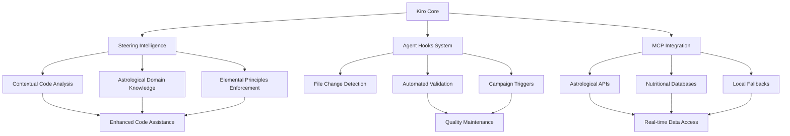

# Design Document

## Overview

The Kiro optimization design creates a comprehensive workspace configuration that transforms Kiro into a specialized development environment for the "WhatToEatNext" astrology-driven food recommendation system. The design emphasizes intelligent automation, contextual assistance, and seamless integration with the project's unique architecture combining TypeScript/React development with astrological calculations and alchemical principles.

The architecture follows a layered approach where steering files provide contextual intelligence, agent hooks automate routine tasks, MCP servers handle external integrations, and optimized settings enhance the development experience. This creates a cohesive ecosystem that understands both modern web development patterns and the specialized domain of culinary astrology.

## Architecture

### Kiro Configuration Hierarchy

```
Kiro Workspace Configuration
├── Steering Files (.kiro/steering/)
│   ├── product.md (Product vision and workflows)
│   ├── structure.md (Project architecture guide)
│   ├── tech.md (Technology stack documentation)
│   ├── astrology-rules.md (Astrological calculation guidelines)
│   ├── elemental-principles.md (Four-element system rules)
│   └── campaign-integration.md (Campaign system patterns)
├── Settings (.kiro/settings/)
│   ├── workspace.json (Workspace-specific settings)
│   ├── mcp.json (MCP server configurations)
│   └── extensions.json (Recommended extensions)
├── Agent Hooks (.kiro/hooks/)
│   ├── planetary-data-validator.md (Planetary position validation)
│   ├── ingredient-consistency-checker.md (Elemental properties validation)
│   ├── typescript-campaign-trigger.md (Automated error cleanup)
│   └── build-quality-monitor.md (Performance and error monitoring)
└── Spec Templates (.kiro/templates/)
    ├── feature-spec-template.md (Standard feature specification)
    ├── astrological-feature-template.md (Astrology-specific features)
    └── campaign-spec-template.md (Code improvement campaigns)
```

### Data Flow Architecture



## Components and Interfaces

### 1. Steering Files System

**Purpose:** Provides contextual intelligence about the project's unique architecture and domain knowledge.

#### Product Steering (product.md)
```markdown
# Product Vision and Workflows

## Core Mission
WhatToEatNext bridges ancient astrological wisdom with modern AI to provide personalized food recommendations based on celestial alignments and elemental harmony.

## Key Workflows
1. **Astrological Meal Planning**: Users receive recommendations based on current planetary positions
2. **Elemental Harmony Matching**: Ingredients and cooking methods aligned with personal elemental profile
3. **Seasonal Adaptation**: Recommendations shift with astronomical seasons and lunar phases
4. **Cultural Integration**: Cuisine recommendations considering astrological and cultural compatibility

## Success Metrics
- Recommendation accuracy based on user satisfaction
- Astrological calculation precision and reliability
- System performance under varying astronomical conditions
```

#### Structure Steering (structure.md)
```markdown
# Project Architecture Guide

## Core Directories
- `/src/app` - Next.js App Router with astrological route organization
- `/src/calculations` - Core astrological and alchemical computation engines
- `/src/data` - Ingredient databases with elemental properties and planetary correspondences
- `/src/components` - React components with astrological context integration
- `/src/services` - Business logic services including campaign systems
- `/src/astro` - Specialized astrological visualization components

## Key Patterns
- **Elemental Properties**: All ingredients have Fire/Water/Earth/Air values
- **Planetary Correspondences**: Components integrate current planetary positions
- **Campaign Systems**: Automated code quality improvement systems
- **Context Providers**: Astrological state shared across component tree
```

#### Technology Steering (tech.md)
```markdown
# Technology Stack Documentation

## Core Technologies
- **Next.js 15.3.4**: App Router with TypeScript integration
- **React 19.1.0**: Component architecture with astrological context
- **TypeScript 5.1.6**: Type safety with specialized astrological types
- **Astronomia**: Precise astronomical calculations
- **Astronomy-Engine**: Planetary position calculations

## Specialized Libraries
- **SunCalc**: Solar position calculations
- **Date-fns**: Temporal calculations for astrological timing
- **Zod**: Runtime validation for astrological data

## Development Tools
- **Campaign Systems**: Automated TypeScript error reduction (4,310 → target <100)
- **ESLint**: Code quality with 10,000 warning tolerance during development
- **Jest**: Testing framework with astrological calculation validation
```

#### Astrological Rules Steering (astrology-rules.md)
```markdown
# Astrological Calculation Guidelines

## Planetary Position System
- Primary: astronomy-engine calculations
- Validation: Transit date verification against stored data
- Fallback: Latest known positions (May 16, 2024)
- Update Pattern: Transit dates in `/src/data/planets/[planet].ts`

## Elemental Harmony Principles
- All elements (Fire, Water, Earth, Air) are individually valuable
- No opposing elements - all combinations have good compatibility (0.7+)
- Same-element combinations have highest affinity (0.9+)
- Self-reinforcement: elements work best with themselves

## Calculation Reliability
- Always validate planetary positions against transit dates
- Implement graceful fallbacks for calculation failures
- Maintain accuracy for food recommendation algorithms
- Test astronomical edge cases (retrograde, sign changes)
```

### 2. Agent Hooks System

**Purpose:** Automates routine tasks and maintains code quality through intelligent monitoring.

#### Planetary Data Validator Hook
```yaml
name: "Planetary Data Validator"
trigger: 
  - file_change: "src/data/planets/*.ts"
  - file_change: "src/calculations/culinary/*.ts"
scope: "planetary-calculations"
actions:
  - validate_transit_dates
  - check_position_consistency
  - run_astronomical_tests
  - update_fallback_positions
approval: auto
rollback: git_stash
```

#### Ingredient Consistency Checker Hook
```yaml
name: "Ingredient Consistency Checker"
trigger:
  - file_change: "src/data/ingredients/**/*.ts"
  - file_change: "src/constants/elemental*.ts"
scope: "ingredient-data"
actions:
  - validate_elemental_properties
  - check_compatibility_scores
  - verify_alchemical_mappings
  - run_ingredient_tests
approval: auto
rollback: file_backup
```

#### TypeScript Campaign Trigger Hook
```yaml
name: "TypeScript Campaign Trigger"
trigger:
  - typescript_errors: "> 4500"
  - build_failure: "type_errors"
scope: "codebase-quality"
actions:
  - analyze_error_distribution
  - trigger_campaign_system
  - create_fix_recommendations
  - schedule_batch_processing
approval: manual
rollback: campaign_stash
```

### 3. MCP Integration System

**Purpose:** Connects to external APIs with robust fallback mechanisms for astrological and nutritional data.

#### MCP Server Configuration
```json
{
  "mcpServers": {
    "astrology-api": {
      "command": "uvx",
      "args": ["astrology-mcp-server@latest"],
      "env": {
        "API_TIMEOUT": "5000",
        "FALLBACK_MODE": "local"
      },
      "disabled": false,
      "autoApprove": ["get_planetary_positions", "get_lunar_phase"]
    },
    "nutrition-api": {
      "command": "uvx", 
      "args": ["nutrition-mcp-server@latest"],
      "env": {
        "USDA_API_KEY": "${USDA_API_KEY}",
        "CACHE_DURATION": "3600"
      },
      "disabled": false,
      "autoApprove": ["get_nutritional_data", "search_ingredients"]
    },
    "spoonacular-api": {
      "command": "uvx",
      "args": ["spoonacular-mcp-server@latest"],
      "env": {
        "SPOONACULAR_API_KEY": "${SPOONACULAR_API_KEY}",
        "RATE_LIMIT": "150/day"
      },
      "disabled": false,
      "autoApprove": ["get_recipe_data", "search_recipes"]
    }
  }
}
```

#### Fallback Strategy
```typescript
interface MCPFallbackConfig {
  primarySource: 'api' | 'local';
  fallbackChain: Array<'api' | 'local' | 'cache'>;
  timeoutMs: number;
  retryAttempts: number;
  cacheValidityHours: number;
}

const astrologyFallback: MCPFallbackConfig = {
  primarySource: 'api',
  fallbackChain: ['cache', 'local'],
  timeoutMs: 5000,
  retryAttempts: 3,
  cacheValidityHours: 1
};
```

### 4. Workspace Settings Optimization

**Purpose:** Configures Kiro for optimal TypeScript/React development with astrological domain support.

#### Core Settings
```json
{
  "typescript.preferences.includePackageJsonAutoImports": "on",
  "typescript.suggest.autoImports": true,
  "typescript.preferences.importModuleSpecifier": "relative",
  "typescript.inlayHints.parameterNames.enabled": "all",
  "typescript.inlayHints.variableTypes.enabled": true,
  "typescript.inlayHints.functionLikeReturnTypes.enabled": true,
  
  "editor.codeActionsOnSave": {
    "source.fixAll.eslint": true,
    "source.organizeImports": true
  },
  
  "files.associations": {
    "*.astro": "typescript",
    "*.alchm": "typescript"
  },
  
  "search.exclude": {
    "**/node_modules": true,
    "**/.next": true,
    "**/dist": true,
    "**/*.log": true,
    "**/metrics": true
  }
}
```

#### Extension Recommendations
```json
{
  "recommendations": [
    "ms-vscode.vscode-typescript-next",
    "bradlc.vscode-tailwindcss",
    "esbenp.prettier-vscode",
    "ms-vscode.vscode-json",
    "formulahendry.auto-rename-tag",
    "christian-kohler.path-intellisense",
    "ms-vscode.vscode-eslint",
    "orta.vscode-jest",
    "ms-vscode.vscode-markdown",
    "yzhang.markdown-all-in-one"
  ]
}
```

### 5. Spec-Driven Development Templates

**Purpose:** Standardizes feature development with EARS-format acceptance criteria and astrological considerations.

#### Astrological Feature Template
```markdown
# [Feature Name] Requirements

## Introduction
[Feature description with astrological context]

## Requirements

### Requirement 1: [Astrological Integration]
**User Story:** As a user, I want [astrological feature], so that [cosmic benefit].

#### Acceptance Criteria
1. WHEN [astronomical condition] THEN system SHALL [astrological response]
2. WHEN planetary positions change THEN recommendations SHALL update accordingly
3. IF calculations fail THEN system SHALL use validated fallback positions
4. WHEN elemental properties are calculated THEN they SHALL follow harmony principles
5. IF user preferences conflict with cosmic conditions THEN system SHALL provide balanced recommendations

### Requirement 2: [Performance and Reliability]
**User Story:** As a user, I want reliable astrological calculations, so that recommendations are accurate.

#### Acceptance Criteria
1. WHEN astronomical calculations are performed THEN they SHALL complete within 2 seconds
2. WHEN API calls fail THEN fallback mechanisms SHALL activate automatically
3. WHEN data is cached THEN it SHALL remain valid for appropriate time periods
4. WHEN errors occur THEN user-friendly messages SHALL be displayed
5. IF system load is high THEN performance SHALL remain acceptable
```

## Data Models

### Kiro Configuration Models

```typescript
interface KiroWorkspaceConfig {
  steering: SteeringConfig;
  hooks: AgentHookConfig[];
  mcp: MCPServerConfig;
  settings: WorkspaceSettings;
  templates: SpecTemplateConfig;
}

interface SteeringConfig {
  files: SteeringFile[];
  inclusion: 'always' | 'conditional' | 'manual';
  fileMatchPattern?: string;
  contextKey?: string;
}

interface SteeringFile {
  name: string;
  path: string;
  content: string;
  references: FileReference[];
  inclusion: InclusionType;
}

interface AgentHookConfig {
  name: string;
  triggers: HookTrigger[];
  scope: string;
  actions: HookAction[];
  approval: 'auto' | 'manual';
  rollback: RollbackStrategy;
}

interface MCPServerConfig {
  servers: Record<string, MCPServer>;
  fallbackStrategy: FallbackConfig;
  credentials: CredentialConfig;
}
```

### Astrological Domain Models

```typescript
interface AstrologicalContext {
  planetaryPositions: PlanetaryPositions;
  lunarPhase: LunarPhase;
  seasonalState: SeasonalState;
  elementalInfluences: ElementalInfluences;
  transitValidation: TransitValidation;
}

interface ElementalHarmonyRules {
  selfReinforcement: boolean; // Always true
  opposingElements: never; // No opposing elements
  compatibilityMinimum: 0.7; // All combinations good
  sameElementAffinity: 0.9; // Highest compatibility
}

interface CampaignIntegration {
  errorThresholds: ErrorThresholds;
  automationRules: AutomationRule[];
  qualityMetrics: QualityMetric[];
  reportingConfig: ReportingConfig;
}
```

## Error Handling

### Kiro-Specific Error Handling

```typescript
interface KiroErrorHandler {
  steeringFileErrors: (error: SteeringError) => void;
  hookExecutionErrors: (error: HookError) => void;
  mcpConnectionErrors: (error: MCPError) => void;
  settingsValidationErrors: (error: SettingsError) => void;
}

interface ErrorRecoveryStrategy {
  steeringFallback: 'default' | 'minimal' | 'disable';
  hookFailureAction: 'retry' | 'skip' | 'manual';
  mcpFallbackChain: Array<'cache' | 'local' | 'disable'>;
  settingsReset: 'partial' | 'full' | 'preserve';
}
```

### Astrological Calculation Error Handling

```typescript
interface AstrologicalErrorHandler {
  calculationFailure: (error: CalculationError) => FallbackPositions;
  transitValidationError: (error: TransitError) => ValidationResult;
  apiTimeoutError: (error: TimeoutError) => CachedData;
  dataCorruptionError: (error: DataError) => CleanData;
}
```

## Testing Strategy

### Kiro Configuration Testing

```typescript
describe('Kiro Configuration', () => {
  test('steering files load correctly', () => {
    // Test steering file parsing and inclusion
  });
  
  test('agent hooks trigger appropriately', () => {
    // Test hook trigger conditions and actions
  });
  
  test('MCP servers connect with fallbacks', () => {
    // Test MCP connection and fallback mechanisms
  });
  
  test('settings optimize development experience', () => {
    // Test TypeScript and React development enhancements
  });
});
```

### Astrological Domain Testing

```typescript
describe('Astrological Intelligence', () => {
  test('planetary position validation', () => {
    // Test transit date validation and fallbacks
  });
  
  test('elemental harmony enforcement', () => {
    // Test four-element system principles
  });
  
  test('campaign system integration', () => {
    // Test automated quality improvement triggers
  });
});
```

## Performance Optimization

### Kiro Performance Enhancements

```typescript
interface PerformanceConfig {
  steeringCaching: boolean;
  hookDebouncing: number; // milliseconds
  mcpConnectionPooling: boolean;
  settingsLazyLoading: boolean;
}

const optimizedConfig: PerformanceConfig = {
  steeringCaching: true,
  hookDebouncing: 500,
  mcpConnectionPooling: true,
  settingsLazyLoading: true
};
```

### Development Workflow Optimization

```typescript
interface WorkflowOptimization {
  autoSave: boolean;
  incrementalTypeChecking: boolean;
  fastRefresh: boolean;
  parallelLinting: boolean;
  cacheAstrologicalCalculations: boolean;
}
```

## Security Considerations

### Credential Management

```typescript
interface CredentialSecurity {
  apiKeyStorage: 'environment' | 'keychain' | 'encrypted';
  mcpAuthentication: 'token' | 'certificate' | 'oauth';
  localDataEncryption: boolean;
  auditLogging: boolean;
}
```

### Access Control

```typescript
interface AccessControl {
  hookExecutionPermissions: Permission[];
  mcpServerAccess: ServerAccess[];
  settingsModificationRights: ModificationRight[];
  steeringFileEditRights: EditRight[];
}
```

## Integration Points

### Campaign System Integration

```typescript
interface CampaignIntegration {
  errorMonitoring: {
    thresholds: ErrorThreshold[];
    triggers: CampaignTrigger[];
    automation: AutomationRule[];
  };
  
  qualityMetrics: {
    typeScriptErrors: number;
    lintWarnings: number;
    buildPerformance: PerformanceMetric[];
    codeComplexity: ComplexityMetric[];
  };
  
  reportingIntegration: {
    dashboardUpdates: boolean;
    progressTracking: boolean;
    successMetrics: SuccessMetric[];
  };
}
```

### External Tool Integration

```typescript
interface ExternalIntegration {
  gitIntegration: {
    commitHooks: boolean;
    branchProtection: boolean;
    pullRequestChecks: boolean;
  };
  
  cicdIntegration: {
    buildValidation: boolean;
    deploymentChecks: boolean;
    qualityGates: boolean;
  };
  
  monitoringIntegration: {
    errorTracking: boolean;
    performanceMonitoring: boolean;
    usageAnalytics: boolean;
  };
}
```

## Accessibility and User Experience

### Developer Experience Optimization

```typescript
interface DeveloperExperience {
  contextualHelp: boolean;
  intelligentSuggestions: boolean;
  domainSpecificSnippets: boolean;
  astrologicalCalculationHelpers: boolean;
  elementalPrincipleEnforcement: boolean;
}
```

### Onboarding and Documentation

```typescript
interface OnboardingSystem {
  interactiveGuides: Guide[];
  contextualTooltips: Tooltip[];
  domainKnowledgeBase: KnowledgeBase;
  troubleshootingGuides: TroubleshootingGuide[];
  bestPracticeExamples: Example[];
}
```