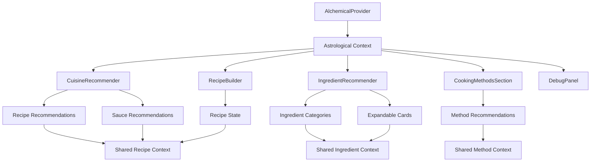

# Design Document

## Overview

The main page restoration design focuses on creating a stable, performant, and user-friendly main page that serves as the central hub for the "What To Eat Next" application. The design emphasizes component isolation, error resilience, and seamless integration of astrological data across all recommender components.

The architecture follows a modular approach where each major component (Debug, Cuisine Recommender, Ingredient Recommender, Cooking Methods Section, and Recipe Builder) operates independently while sharing common astrological context. This ensures that if one component fails, others continue to function normally.

## Architecture

### Component Hierarchy

```
App (Main Container)
├── AlchemicalProvider (Context Provider)
├── ErrorBoundary (Global Error Handling)
├── MainPageLayout
    ├── Header Section
    │   ├── Title and Description
    │   └── Loading Status Indicator
    ├── Navigation Section (Sticky)
    │   └── Jump Links to Sections
    ├── Content Sections (Single Column, Stacked)
    │   ├── CuisineRecommender Section
    │   ├── IngredientRecommender Section
    │   ├── CookingMethodsSection
    │   └── RecipeBuilder Section
    ├── Debug Panel (Fixed Bottom Right)
    │   ├── ConsolidatedDebugInfo
    │   ├── AstrologicalDataDisplay
    │   └── PerformanceMetrics
    └── Footer Section
```

### Data Flow Architecture



## Components and Interfaces

### 1. MainPageLayout Component

**Purpose:** Provides the main layout structure with single-column stacked sections matching the current page design.

**Interface:**
```typescript
interface MainPageLayoutProps {
  children: React.ReactNode;
  debugMode?: boolean;
  loading?: boolean;
  onSectionNavigate?: (sectionId: string) => void;
}

interface SectionConfig {
  id: string;
  title: string;
  component: React.ComponentType;
  loading: boolean;
  error: string | null;
}
```

**Key Features:**
- Single-column stacked layout
- Sticky navigation with jump links
- Section-based error boundaries
- Loading state management per section
- Debug panel toggle (fixed bottom right)

### 2. ConsolidatedDebugInfo Component

**Purpose:** Consolidates all debug information into a single, toggleable panel in the bottom right.

**Interface:**
```typescript
interface DebugInfoProps {
  position?: 'bottom-right' | 'bottom-left' | 'top-right';
  collapsible?: boolean;
  showPerformanceMetrics?: boolean;
  showAstrologicalData?: boolean;
  showComponentStates?: boolean;
}

interface DebugData {
  astrologicalState: AstrologicalState;
  componentStates: ComponentStateMap;
  performanceMetrics: PerformanceMetrics;
  errorLog: ErrorEntry[];
}
```

**Key Features:**
- Real-time astrological data display
- Component state monitoring
- Performance metrics tracking
- Error logging and display
- Collapsible interface

### 3. Enhanced CuisineRecommender Component

**Purpose:** Provides cuisine recommendations with nested recipe and sauce suggestions.

**Interface:**
```typescript
interface CuisineRecommenderProps {
  maxRecommendations?: number;
  showNestedRecommendations?: boolean;
  onCuisineSelect?: (cuisine: CuisineData) => void;
  onRecipeSelect?: (recipe: RecipeData) => void;
}

interface CuisineData {
  id: string;
  name: string;
  elementalProperties: ElementalProperties;
  recipes: RecipeData[];
  sauces: SauceData[];
  culturalContext: string;
  astrologicalInfluences: string[];
}
```

**Key Features:**
- Astrological-based cuisine scoring
- Nested recipe recommendations
- Sauce pairing suggestions
- Cultural context display
- Error fallback with default cuisines

### 4. Enhanced IngredientRecommender Component

**Purpose:** Displays categorized ingredients with expandable cards showing culinary properties.

**Interface:**
```typescript
interface IngredientRecommenderProps {
  categories?: string[];
  maxPerCategory?: number;
  expandable?: boolean;
  showCulinaryData?: boolean;
}

interface IngredientCard {
  id: string;
  name: string;
  category: string;
  culinaryProperties: CulinaryProperties;
  astrologicalCorrespondences: AstrologicalData;
  nutritionalInfo: NutritionalData;
  expanded: boolean;
}

interface CulinaryProperties {
  flavorProfile: string[];
  cookingMethods: string[];
  seasonality: string[];
  pairings: string[];
  preparationTips: string[];
}
```

**Key Features:**
- Category-based organization
- Expandable ingredient cards
- Detailed culinary property display
- Astrological correspondence information
- Search and filter capabilities

### 5. Enhanced CookingMethodsSection Component

**Purpose:** Mini version of the full cooking methods recommender with navigation to full page.

**Interface:**
```typescript
interface CookingMethodsSectionProps {
  methods: CookingMethod[];
  maxDisplayed?: number;
  showToggle?: boolean;
  onMethodSelect?: (method: CookingMethod) => void;
  onViewMore?: () => void;
}

interface CookingMethod {
  id: string;
  name: string;
  description: string;
  elementalEffect: ElementalProperties;
  suitableFor: string[];
  duration: TimeRange;
  difficulty: 'Easy' | 'Medium' | 'Hard';
  astrologicalTiming: string[];
}
```

**Key Features:**
- Astrological timing recommendations
- Method difficulty indicators
- Elemental effect visualization
- Navigation to full cooking methods page
- Responsive display with toggle

### 6. RecipeBuilder Component

**Purpose:** Allows users to build custom recipes using recommended ingredients and methods.

**Interface:**
```typescript
interface RecipeBuilderProps {
  initialIngredients?: string[];
  initialMethods?: string[];
  onRecipeComplete?: (recipe: CustomRecipe) => void;
  onSave?: (recipe: CustomRecipe) => void;
}

interface CustomRecipe {
  id: string;
  name: string;
  ingredients: RecipeIngredient[];
  methods: CookingMethod[];
  instructions: string[];
  timing: RecipeTiming;
  servings: number;
  astrologicalOptimization: AstrologicalTiming;
}

interface RecipeIngredient {
  ingredient: IngredientData;
  quantity: string;
  preparation: string;
  timing: 'early' | 'middle' | 'late';
}
```

**Key Features:**
- Drag-and-drop ingredient addition
- Method selection and sequencing
- Automatic instruction generation
- Astrological timing optimization
- Recipe saving and sharing

## Data Models

### Shared Context Models

```typescript
interface AstrologicalContext {
  planetaryPositions: PlanetaryPositions;
  elementalState: ElementalProperties;
  alchemicalValues: AlchemicalProperties;
  lunarPhase: string;
  planetaryHour: string;
  isDaytime: boolean;
}

interface ComponentState {
  loading: boolean;
  error: string | null;
  data: unknown;
  lastUpdated: Date;
}

interface PerformanceMetrics {
  renderTime: number;
  dataFetchTime: number;
  memoryUsage: number;
  errorCount: number;
}
```

### Component-Specific Models

```typescript
interface ElementalProperties {
  Fire: number;
  Water: number;
  Earth: number;
  Air: number;
}

interface AlchemicalProperties {
  Spirit: number;
  Essence: number;
  Matter: number;
  Substance: number;
}

interface ScoredRecommendation {
  item: unknown;
  score: number;
  reasoning: string[];
  astrologicalFactors: string[];
}
```

## Error Handling

### Error Boundary Strategy

1. **Global Error Boundary:** Catches unhandled errors and prevents complete page crashes
2. **Component-Level Error Boundaries:** Each major component wrapped in its own error boundary
3. **Graceful Degradation:** Components display fallback content when errors occur
4. **Error Reporting:** All errors logged to debug panel and console

### Error Recovery Mechanisms

```typescript
interface ErrorRecoveryConfig {
  maxRetries: number;
  retryDelay: number;
  fallbackComponent: React.ComponentType;
  errorReporting: boolean;
}

interface ErrorBoundaryState {
  hasError: boolean;
  error: Error | null;
  errorInfo: ErrorInfo | null;
  retryCount: number;
}
```

## Testing Strategy

### Unit Testing
- Individual component functionality
- Astrological calculation accuracy
- Error handling scenarios
- Performance benchmarks

### Integration Testing
- Component interaction flows
- Context data sharing
- Navigation between components
- Error boundary effectiveness

### End-to-End Testing
- Complete user workflows
- Cross-component data flow
- Performance under load
- Mobile responsiveness

### Testing Tools
- Jest for unit tests
- React Testing Library for component tests
- Cypress for E2E tests
- Performance monitoring with Web Vitals

## Performance Optimization

### Rendering Optimization
- React.memo for expensive components
- useMemo for complex calculations
- useCallback for event handlers
- Lazy loading for non-critical components

### Data Management
- Efficient context updates
- Debounced user inputs
- Cached astrological calculations
- Optimized re-renders

### Bundle Optimization
- Code splitting by component
- Dynamic imports for heavy features
- Tree shaking for unused code
- Optimized asset loading

## Accessibility Considerations

### WCAG Compliance
- Semantic HTML structure
- Proper ARIA labels
- Keyboard navigation support
- Screen reader compatibility

### User Experience
- High contrast mode support
- Reduced motion preferences
- Focus management
- Error message clarity

## Mobile Responsiveness

### Breakpoint Strategy
- Mobile-first design approach
- Flexible grid layouts
- Touch-friendly interactions
- Optimized component sizing

### Component Adaptations
- Collapsible sections on mobile
- Simplified debug panel
- Touch gestures for cards
- Responsive navigation