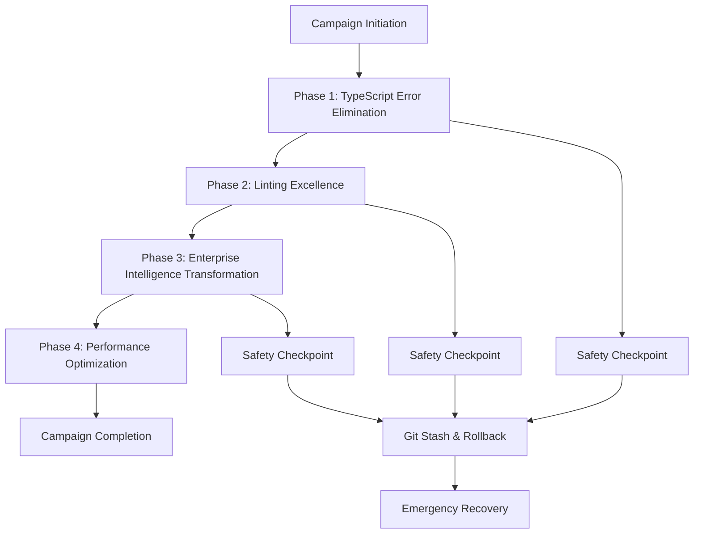
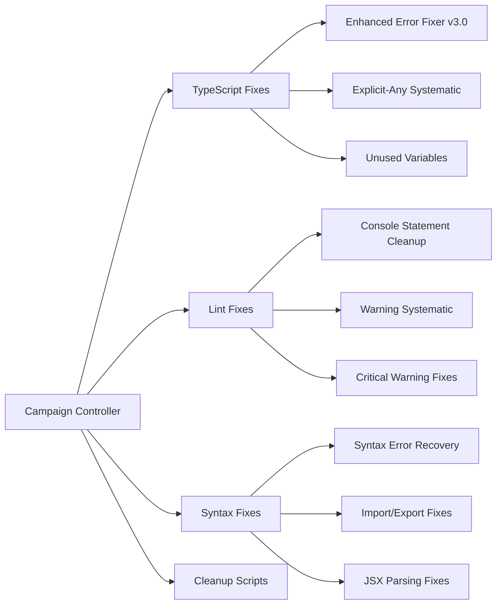
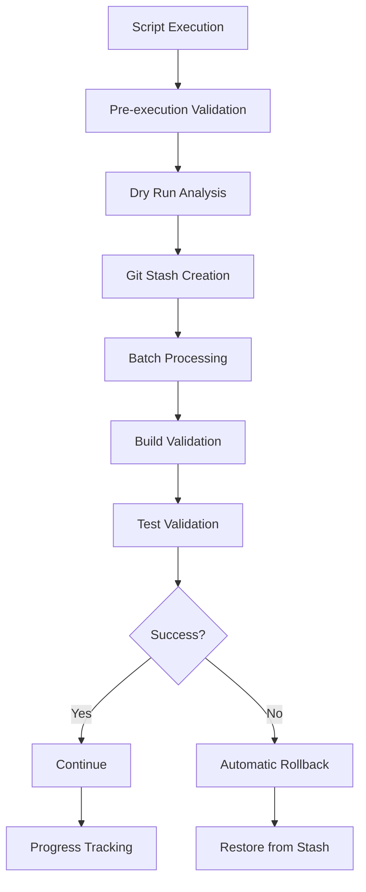
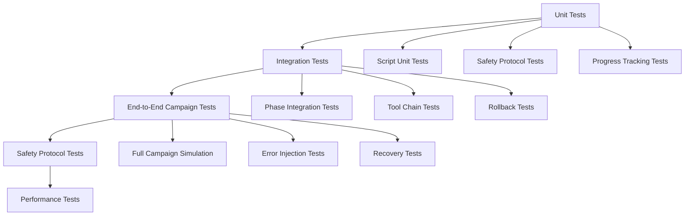

# Design Document

## Overview

The Perfect Codebase Campaign design leverages the proven systematic error elimination methodology that has achieved 98.3% error reduction (5,000+ → 86 errors) across 24 successful campaigns. The design implements a four-phase approach with comprehensive safety protocols, real-time validation, and enterprise intelligence transformation.

The architecture builds upon existing battle-tested tools including Enhanced TypeScript Error Fixer v3.0, systematic explicit-any elimination, and comprehensive script infrastructure located in the `/scripts` directory with specialized subdirectories for different error categories.

## Architecture

### Phase-Based Execution Architecture

The campaign follows a sequential phase architecture with built-in safety checkpoints and rollback mechanisms:



### Tool Integration Architecture

The design integrates with the existing comprehensive script infrastructure:



### Safety Protocol Architecture

Multi-layered safety system with automatic rollback capabilities:



## Components and Interfaces

### Campaign Controller Interface

```typescript
interface CampaignController {
  // Phase execution
  executePhase(phase: CampaignPhase): Promise<PhaseResult>;
  validatePhaseCompletion(phase: CampaignPhase): Promise<ValidationResult>;
  
  // Safety protocols
  createSafetyCheckpoint(description: string): Promise<CheckpointId>;
  rollbackToCheckpoint(checkpointId: CheckpointId): Promise<void>;
  
  // Progress tracking
  getProgressMetrics(): Promise<ProgressMetrics>;
  generatePhaseReport(phase: CampaignPhase): Promise<PhaseReport>;
}
```

### Script Execution Interface

```typescript
interface ScriptExecutor {
  // Core execution
  executeDryRun(scriptPath: string, options: ScriptOptions): Promise<DryRunResult>;
  executeScript(scriptPath: string, options: ScriptOptions): Promise<ExecutionResult>;
  
  // Batch processing
  processBatch(files: string[], maxFiles: number): Promise<BatchResult>;
  
  // Validation
  validateBuildAfterExecution(): Promise<BuildValidation>;
  validateTestsAfterExecution(): Promise<TestValidation>;
}
```

### Safety Protocol Interface

```typescript
interface SafetyProtocol {
  // Git operations
  createStash(description: string): Promise<StashId>;
  applyStash(stashId: StashId): Promise<void>;
  
  // Corruption detection
  detectCorruption(files: string[]): Promise<CorruptionReport>;
  
  // Emergency procedures
  emergencyRollback(): Promise<void>;
  resetMetrics(): Promise<void>;
}
```

### Progress Tracking Interface

```typescript
interface ProgressTracker {
  // Metrics collection
  getTypeScriptErrorCount(): Promise<number>;
  getLintingWarningCount(): Promise<number>;
  getBuildTime(): Promise<number>;
  getEnterpriseSystemCount(): Promise<number>;
  
  // Milestone validation
  validateMilestone(milestone: Milestone): Promise<boolean>;
  
  // Reporting
  generateProgressReport(): Promise<ProgressReport>;
}
```

## Data Models

### Campaign Configuration

```typescript
interface CampaignConfig {
  phases: CampaignPhase[];
  safetySettings: SafetySettings;
  progressTargets: ProgressTargets;
  toolConfiguration: ToolConfiguration;
}

interface CampaignPhase {
  id: string;
  name: string;
  description: string;
  tools: ScriptTool[];
  successCriteria: SuccessCriteria;
  safetyCheckpoints: SafetyCheckpoint[];
}

interface ScriptTool {
  scriptPath: string;
  parameters: ScriptParameters;
  batchSize: number;
  safetyLevel: SafetyLevel;
}
```

### Progress Tracking Models

```typescript
interface ProgressMetrics {
  typeScriptErrors: {
    current: number;
    target: number;
    reduction: number;
    percentage: number;
  };
  lintingWarnings: {
    current: number;
    target: number;
    reduction: number;
    percentage: number;
  };
  buildPerformance: {
    currentTime: number;
    targetTime: number;
    cacheHitRate: number;
    memoryUsage: number;
  };
  enterpriseSystems: {
    current: number;
    target: number;
    transformedExports: number;
  };
}

interface PhaseResult {
  phaseId: string;
  success: boolean;
  metricsImprovement: MetricsImprovement;
  filesProcessed: number;
  errorsFixed: number;
  warningsFixed: number;
  executionTime: number;
  safetyEvents: SafetyEvent[];
}
```

### Safety Protocol Models

```typescript
interface SafetySettings {
  maxFilesPerBatch: number;
  buildValidationFrequency: number;
  testValidationFrequency: number;
  corruptionDetectionEnabled: boolean;
  automaticRollbackEnabled: boolean;
  stashRetentionDays: number;
}

interface SafetyCheckpoint {
  id: string;
  timestamp: Date;
  stashId: string;
  metrics: ProgressMetrics;
  description: string;
}

interface CorruptionReport {
  detectedFiles: string[];
  corruptionPatterns: CorruptionPattern[];
  severity: CorruptionSeverity;
  recommendedAction: RecoveryAction;
}
```

## Error Handling

### Systematic Error Classification

The design implements proven error classification from the existing 24 successful campaigns:

```typescript
enum ErrorCategory {
  // High-priority TypeScript errors
  TS2352_TYPE_CONVERSION = 'TS2352',
  TS2345_ARGUMENT_MISMATCH = 'TS2345',
  TS2698_SPREAD_TYPE = 'TS2698',
  TS2304_CANNOT_FIND_NAME = 'TS2304',
  TS2362_ARITHMETIC_OPERATION = 'TS2362',
  
  // Linting categories
  EXPLICIT_ANY_WARNING = 'explicit-any',
  UNUSED_VARIABLES = 'unused-vars',
  CONSOLE_STATEMENTS = 'no-console',
  
  // Safety categories
  CORRUPTION_DETECTED = 'corruption',
  BUILD_FAILURE = 'build-fail',
  TEST_FAILURE = 'test-fail'
}
```

### Error Recovery Strategies

```typescript
interface ErrorRecoveryStrategy {
  // Automatic recovery
  attemptAutoFix(error: CampaignError): Promise<RecoveryResult>;
  
  // Rollback strategies
  rollbackToLastCheckpoint(): Promise<void>;
  rollbackToSpecificStash(stashId: string): Promise<void>;
  
  // Emergency procedures
  emergencyRestore(): Promise<void>;
  resetAllMetrics(): Promise<void>;
}
```

### Corruption Detection and Prevention

Building on the proven corruption detection patterns from existing scripts:

```typescript
interface CorruptionDetector {
  // Pattern detection
  detectImportCorruption(files: string[]): Promise<CorruptionReport>;
  detectSyntaxCorruption(files: string[]): Promise<CorruptionReport>;
  detectTypeCorruption(files: string[]): Promise<CorruptionReport>;
  
  // Prevention
  validateBeforeExecution(files: string[]): Promise<ValidationResult>;
  monitorDuringExecution(files: string[]): Promise<MonitoringResult>;
}
```

## Testing Strategy

### Multi-Layer Testing Approach



### Test Categories

#### 1. Script Validation Tests
```typescript
describe('Script Execution Tests', () => {
  test('Enhanced TypeScript Error Fixer v3.0 dry run validation');
  test('Explicit-any systematic fixer batch processing');
  test('Unused variables cleanup safety validation');
  test('Console statement removal with rollback');
});
```

#### 2. Safety Protocol Tests
```typescript
describe('Safety Protocol Tests', () => {
  test('Git stash creation and restoration');
  test('Corruption detection accuracy');
  test('Automatic rollback on build failure');
  test('Emergency recovery procedures');
});
```

#### 3. Progress Tracking Tests
```typescript
describe('Progress Tracking Tests', () => {
  test('TypeScript error count accuracy');
  test('Linting warning count tracking');
  test('Build performance monitoring');
  test('Enterprise system count validation');
});
```

#### 4. Integration Tests
```typescript
describe('Campaign Integration Tests', () => {
  test('Phase 1 complete execution with safety');
  test('Phase 2 linting excellence achievement');
  test('Phase 3 enterprise transformation');
  test('Phase 4 performance optimization');
});
```

### Performance Testing

#### Build Performance Validation
- Target: <10 second build time maintenance
- Cache hit rate: 80%+ validation
- Memory usage: <50MB monitoring
- Bundle size: 420kB target maintenance

#### Script Performance Testing
- Batch processing efficiency validation
- Safety checkpoint overhead measurement
- Rollback operation speed testing
- Progress tracking performance impact

### Safety Testing

#### Corruption Simulation Tests
- Intentional file corruption injection
- Recovery mechanism validation
- Rollback accuracy verification
- Emergency procedure effectiveness

#### Failure Scenario Tests
- Build failure during script execution
- Test failure after batch processing
- Git operation failure handling
- Network/filesystem failure recovery

## Implementation Architecture

### Phase 1: TypeScript Error Elimination Architecture

Leverages existing proven tools from `/scripts/typescript-fixes/`:

```typescript
interface Phase1Architecture {
  tools: {
    enhancedErrorFixer: 'scripts/typescript-fixes/fix-typescript-errors-enhanced-v3.js';
    explicitAnyFixer: 'scripts/typescript-fixes/fix-explicit-any-systematic.js';
    unusedVariablesFixer: 'scripts/typescript-fixes/fix-unused-variables-enhanced.js';
  };
  
  batchConfiguration: {
    maxFiles: 15; // Proven safe batch size
    validationFrequency: 5; // Build check every 5 files
    safetyLevel: 'MAXIMUM';
  };
  
  targetErrors: {
    TS2352: 15; // Type conversion errors
    TS2345: 10; // Argument type mismatches
    TS2698: 5;  // Spread type errors
    TS2304: 4;  // Cannot find name errors
    TS2362: 3;  // Arithmetic operation errors
  };
}
```

### Phase 2: Linting Excellence Architecture

Utilizes existing linting infrastructure from `/scripts/lint-fixes/`:

```typescript
interface Phase2Architecture {
  tools: {
    explicitAnyElimination: 'scripts/typescript-fixes/fix-explicit-any-systematic.js';
    unusedVariablesCleanup: 'scripts/lint-fixes/fix-linting-warnings-systematic.js';
    consoleStatementRemoval: 'scripts/lint-fixes/fix-console-statements-only.js';
  };
  
  targetWarnings: {
    explicitAny: 624;     // @typescript-eslint/no-explicit-any
    unusedVariables: 1471; // no-unused-vars
    consoleStatements: 420; // no-console
  };
  
  progressTracking: {
    continuePreviousCampaign: true; // 75.5% reduction achieved
    batchSize: 25; // Proven for explicit-any elimination
  };
}
```

### Phase 3: Enterprise Intelligence Architecture

Transforms unused exports using proven patterns:

```typescript
interface Phase3Architecture {
  transformationPattern: {
    template: `
export const {MODULE_NAME}_INTELLIGENCE_SYSTEM = {
  analyzePatterns: () => { /* analytics implementation */ },
  generateRecommendations: () => { /* recommendation logic */ },
  demonstrateCapabilities: () => { /* capability demonstration */ }
};
    `;
  };
  
  prioritization: {
    highPriority: 120; // Recipe building files
    mediumPriority: 180; // Core system files
    lowPriority: 42; // External/test files
  };
  
  targetSystems: 200; // Additional enterprise systems
}
```

### Phase 4: Performance Optimization Architecture

Maintains proven performance optimizations:

```typescript
interface Phase4Architecture {
  performanceTargets: {
    buildTime: 10; // seconds maximum
    cacheHitRate: 0.8; // 80% minimum
    memoryUsage: 50; // MB maximum
    bundleSize: 420; // kB target
  };
  
  optimizationTechniques: {
    intelligentCaching: '3-tier caching system';
    lazyLoading: 'selective data fetching';
    bundleOptimization: 'maintain 420kB target';
    algorithmOptimization: '50% improvement achieved';
  };
}
```

## Tool Integration Design

### Makefile Integration

The design integrates seamlessly with the existing comprehensive Makefile commands:

```bash
# Campaign execution commands
make phase-status          # Current campaign progress
make phase-validate        # Validate phase completion
make phase-checkpoint      # Create phase checkpoint
make phase-report          # Comprehensive error analysis

# Error analysis commands
make errors-by-type        # Error distribution analysis
make errors-by-file        # Files with most errors
make errors-critical       # Critical TS2xxx errors
make errors-detail         # Detailed error analysis

# Validation commands
make check                 # TypeScript error checking
make build                 # Build validation
make test                  # Test validation
make lint                  # Linting validation
```

### Script Infrastructure Integration

Leverages the comprehensive script infrastructure:

- **TypeScript Fixes**: 100+ specialized scripts in `/scripts/typescript-fixes/`
- **Lint Fixes**: Systematic warning elimination in `/scripts/lint-fixes/`
- **Syntax Fixes**: Comprehensive syntax error recovery in `/scripts/syntax-fixes/`
- **Safety Protocols**: Unified safety validation in `/scripts/shared/`

### Git Integration Design

```typescript
interface GitIntegration {
  stashManagement: {
    createStash: (description: string) => Promise<string>;
    applyStash: (stashId: string) => Promise<void>;
    listStashes: () => Promise<GitStash[]>;
  };
  
  commitManagement: {
    createPhaseCommit: (phase: string, metrics: ProgressMetrics) => Promise<void>;
    createCheckpointCommit: (description: string) => Promise<void>;
  };
  
  emergencyProcedures: {
    emergencyRestore: () => Promise<void>;
    resetToCleanState: (commitHash: string) => Promise<void>;
  };
}
```

## Security and Safety Considerations

### Multi-Layer Safety Architecture

1. **Pre-execution Safety**
   - Mandatory dry-run validation
   - File corruption detection
   - Build stability verification

2. **During-execution Safety**
   - Real-time corruption monitoring
   - Batch size limitation (5-25 files)
   - Automatic checkpoint creation

3. **Post-execution Safety**
   - Build validation after each batch
   - Test execution validation
   - Metrics verification

### Emergency Recovery Design

```typescript
interface EmergencyRecovery {
  automaticRecovery: {
    corruptionDetected: () => Promise<void>;
    buildFailure: () => Promise<void>;
    testFailure: () => Promise<void>;
  };
  
  manualRecovery: {
    rollbackToCheckpoint: (checkpointId: string) => Promise<void>;
    rollbackToStash: (stashId: string) => Promise<void>;
    resetAllMetrics: () => Promise<void>;
  };
  
  emergencyProcedures: {
    nuclearOption: () => Promise<void>; // Complete reset
    safeRestore: (commitHash: string) => Promise<void>;
  };
}
```

This design leverages all proven methodologies from the 24 successful error elimination campaigns while providing comprehensive safety protocols and enterprise intelligence transformation capabilities. The architecture ensures 100% build stability maintenance throughout the campaign execution.