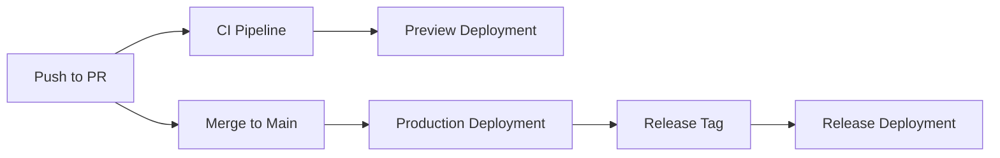

# CI/CD Pipeline Setup for WhatToEatNext

## 🚀 Overview

This document describes the comprehensive CI/CD pipeline setup for the
WhatToEatNext project using Yarn, GitHub Actions, and Vercel deployment.

## 📋 Prerequisites

- Node.js 20.18.0 or higher
- Yarn 1.22.0 or higher
- GitHub repository with Actions enabled
- Vercel account for deployment

## 🏗️ Architecture

### Pipeline Components

1. **GitHub Actions Workflows**
   - `ci.yml` - Main CI/CD pipeline
   - `release.yml` - Release automation
   - `dependency-review.yml` - Security scanning

2. **Build Tools**
   - Yarn for package management
   - Turborepo for build optimization
   - ESLint + Prettier for code quality

3. **Deployment**
   - Vercel for hosting
   - Preview deployments for PRs
   - Production deployments for main branch

## 🔧 Configuration Files

### Core Configuration

| File                                      | Purpose                      |
| ----------------------------------------- | ---------------------------- |
| `.github/workflows/ci.yml`                | Main CI/CD pipeline          |
| `.github/workflows/release.yml`           | Release automation           |
| `.github/workflows/dependency-review.yml` | Security scanning            |
| `.github/dependabot.yml`                  | Automated dependency updates |
| `turbo.json`                              | Turborepo configuration      |
| `.yarnrc.yml`                             | Yarn configuration           |
| `.eslintrc.js`                            | ESLint configuration         |
| `.prettierrc`                             | Prettier configuration       |

### Environment Files

- `.env.local` - Local development
- `.env.example` - Template for environment variables

## 🚀 Quick Start

### 1. Run Setup Script

```bash
# Make script executable
chmod +x scripts/setup-ci.sh

# Run setup
./scripts/setup-ci.sh
```

### 2. Configure GitHub Secrets

Navigate to your GitHub repository: `Settings > Secrets and variables > Actions`

Add the following secrets:

| Secret              | Description             | Required |
| ------------------- | ----------------------- | -------- |
| `VERCEL_TOKEN`      | Vercel deployment token | Yes      |
| `VERCEL_ORG_ID`     | Vercel organization ID  | Yes      |
| `VERCEL_PROJECT_ID` | Vercel project ID       | Yes      |
| `TURBO_TOKEN`       | Turborepo token         | No       |
| `TURBO_TEAM`        | Turborepo team          | No       |

### 3. Push Changes

```bash
git add .
git commit -m "feat: Add comprehensive CI/CD pipeline"
git push origin main
```

## 🔄 Workflow Details

### CI/CD Pipeline (`ci.yml`)

**Triggers:**

- Push to `main` or `develop` branches
- Pull requests to `main` or `develop` branches
- Manual workflow dispatch

**Jobs:**

1. **Security** - Vulnerability scanning
   - Yarn audit
   - Trivy vulnerability scanner
   - GitHub Security tab integration

2. **Lint** - Code quality
   - ESLint
   - TypeScript type checking
   - Prettier formatting

3. **Test** - Testing
   - Jest unit tests
   - Coverage reporting
   - Codecov integration

4. **Build** - Application build
   - Next.js build
   - Artifact upload
   - Turborepo optimization

5. **Deploy Preview** - PR deployments
   - Vercel preview deployment
   - Environment: preview

6. **Deploy Production** - Production deployment
   - Vercel production deployment
   - Environment: production

7. **Lighthouse** - Performance monitoring
   - Lighthouse CI
   - Performance metrics

### Release Automation (`release.yml`)

**Triggers:**

- Push tags matching `v*` pattern

**Features:**

- Automated release creation
- Changelog generation
- Production deployment
- Stakeholder notification

### Dependency Review (`dependency-review.yml`)

**Triggers:**

- Pull requests to `main` or `develop`

**Features:**

- Security vulnerability scanning
- License compliance checking
- Automated PR comments

## 🛠️ Available Scripts

### Development

```bash
# Development
yarn dev              # Start development server
yarn build            # Build for production
yarn start            # Start production server

# Code Quality
yarn lint             # Run ESLint
yarn lint:fix         # Fix ESLint issues
yarn format           # Format with Prettier
yarn type-check       # TypeScript type checking

# Testing
yarn test             # Run tests
yarn test:watch       # Run tests in watch mode
yarn test:coverage    # Run tests with coverage

# Turborepo
yarn turbo:build      # Build with Turborepo
yarn turbo:dev        # Dev with Turborepo
yarn turbo:lint       # Lint with Turborepo
yarn turbo:test       # Test with Turborepo
```

### CI/CD

```bash
# CI/CD specific
yarn ci:install       # Install with frozen lockfile
yarn ci:build         # Build for CI
yarn ci:test          # Test for CI
yarn ci:lint          # Lint for CI
yarn ci:type-check    # Type check for CI

# Security
yarn security:audit   # Run security audit
yarn security:check   # Check for high severity issues

# Dependencies
yarn deps:check       # Check for outdated packages
yarn deps:update      # Interactive dependency updates
```

## 🔒 Security Features

### Vulnerability Scanning

- **Yarn Audit**: Scans for known vulnerabilities
- **Trivy**: Comprehensive vulnerability scanner
- **Dependency Review**: GitHub's dependency scanning

### Security Configuration

```yaml
# .github/workflows/ci.yml
security:
  - yarn audit --level moderate
  - Trivy vulnerability scanner
  - GitHub Security tab integration
```

## 📊 Monitoring & Analytics

### Performance Monitoring

- **Lighthouse CI**: Performance metrics
- **Vercel Analytics**: Real-time performance data
- **Coverage Reports**: Test coverage tracking

### Build Optimization

- **Turborepo**: Incremental builds
- **Yarn Caching**: Dependency caching
- **GitHub Actions Caching**: Workflow optimization

## 🚨 Troubleshooting

### Common Issues

1. **Build Failures**

   ```bash
   # Clear cache and rebuild
   yarn cache:clean
   yarn build:clean
   ```

2. **Dependency Issues**

   ```bash
   # Reinstall dependencies
   yarn install:clean
   ```

3. **TypeScript Errors**

   ```bash
   # Run type checking
   yarn type-check
   ```

4. **ESLint Errors**
   ```bash
   # Fix linting issues
   yarn lint:fix
   ```

### Debug Commands

```bash
# Check Node.js version
node --version

# Check Yarn version
yarn --version

# Validate CI configuration
./scripts/setup-ci.sh

# Run all checks locally
yarn ci:lint && yarn ci:type-check && yarn ci:test && yarn ci:build
```

## 📈 Performance Optimization

### Build Performance

- **Turborepo**: Incremental builds and caching
- **Yarn**: Efficient dependency resolution
- **GitHub Actions**: Parallel job execution

### Caching Strategy

```yaml
# Yarn cache
- uses: actions/setup-node@v4
  with:
    cache: "yarn"

# Build cache
- uses: actions/cache@v3
  with:
    path: .next/cache
```

## 🔄 Deployment Strategy

### Environments

1. **Development**: Local development
2. **Preview**: PR deployments to Vercel
3. **Production**: Main branch deployments

### Deployment Flow



## 📝 Best Practices

### Code Quality

1. **Pre-commit Hooks**: Automatic formatting and linting
2. **Type Safety**: Strict TypeScript configuration
3. **Testing**: Comprehensive test coverage
4. **Documentation**: Inline code documentation

### Security

1. **Dependency Scanning**: Regular vulnerability checks
2. **Secret Management**: Secure environment variables
3. **Access Control**: Proper GitHub permissions
4. **Audit Logging**: Comprehensive logging

### Performance

1. **Build Optimization**: Incremental builds
2. **Caching**: Strategic cache utilization
3. **Monitoring**: Real-time performance tracking
4. **Optimization**: Continuous performance improvement

## 🎯 Next Steps

1. **Configure GitHub Secrets**: Add Vercel and Turborepo tokens
2. **Test Pipeline**: Push changes to trigger CI/CD
3. **Monitor Performance**: Track build and deployment metrics
4. **Optimize**: Continuously improve pipeline performance

## 📚 Additional Resources

- [GitHub Actions Documentation](https://docs.github.com/en/actions)
- [Vercel Documentation](https://vercel.com/docs)
- [Turborepo Documentation](https://turbo.build/repo/docs)
- [Yarn Documentation](https://yarnpkg.com/getting-started)

---

**Happy coding! 🚀**
