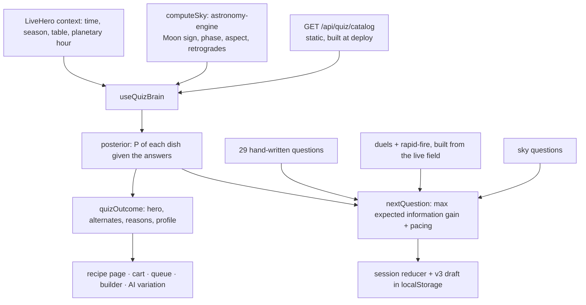

# The homepage quiz: "What are you actually hungry for?"

`LiveHero` mounts a quiz that finds a **real recipe** for this moment. The diner chooses how many questions to answer (3–30). Each next question is the one expected to tell us the most, given every answer so far and the live sky. The result is one of the 918 meal-worthy recipes in the static catalog, along with the reasons it was chosen.

No account is needed. Answers stay in the browser (`localStorage`) unless the diner chooses the AI variation.

## How it works



| Layer | Files |
| --- | --- |
| Dish catalog (server) | `src/lib/quiz/`: `catalogContract.ts` (wire format and zod schema), `dishFeatures.ts`, `featureLexicon.ts`, `dishLexicon.ts`, `dishSafety.ts`, `dishCatalog.ts`, `serverCatalog.ts` |
| Routes | `src/app/api/quiz/catalog/route.ts` (force-static, CDN-cached); `src/app/api/quiz/dish/[id]/route.ts` (the full recipe for cart and queue, rate-limited) |
| Engine (client, pure) | `src/components/home/quiz/engine/`: `effects.ts`, `posterior.ts`, `selector.ts`, `dynamic.ts`, `sky.ts`, `skyQuestions.ts`, `moonLore.ts`, `bank/*`, `result.ts`, `session.ts`, `persistence.ts`, `rng.ts` |
| UI | `QuizProvider` (light: state and persistence only), `QuizBar`, `QuizSurface`, and the lazily loaded `QuizStage`. The stage renders `QuizSetup`, `QuizPulse`, `QuizQuestionCard` with `QuizFormats`, `QuizResultView`, `QuizResultActions`, `QuizAiRecipe` and `QuizFooter`. |

## Where every value comes from

- **Dishes.** The catalog is built from `getServerRecipes()`, keeping only meal-worthy recipes. A recipe qualifies if it has at least three ingredients and instructions, and it isn't a drink or a sub-recipe component such as "Sherry Vinaigrette" or "Spelt Bread (for …)". Of 1,078 static recipes, 918 qualify.
- **Features.** There are 16, each in [0, 1]: warmth, spice, richness, crunch, tender, brothy, fresh, umami, sweet, hearty, effort, adventure, smoky, aromatic, handheld and green. All of them are **COMPUTED** from the recipe's own text:
  - term tables are matched against ingredient names (`featureLexicon.ts` `INGREDIENT_TERMS`) and against the dish name (`NAME_TERMS`);
  - cooking methods come from the authored method list and the instruction text (`METHOD_PATTERNS`, `METHOD_EFFECTS`), except for HSCA, whose authored method lists are placeholders, so its methods come from the instructions only (the measurement is in `dishFeatures.ts`);
  - summed term weights pass through a saturating curve, 1 − e^(−x/k);
  - `spice` is the larger of the authored spice level and a chili-term count;
  - `effort` combines time on a log scale, step count and craft techniques;
  - `adventure` is the dish's percentile of ingredient rarity within this catalog (the mean IDF of its three rarest tokens).
- **Diets.** These come from the repo's own `classifyIngredientDiet`. A dish counts as vegan or vegetarian only if no ingredient is non-compliant or unknown.
- **Allergens.** These are name-term flags in `dishSafety.ts`, tuned to flag rather than miss. They are used only to **exclude** dishes, never to certify a dish as safe, and the UI tells the diner to check labels.
- **The sky.** It is computed in the browser with astronomy-engine (`accurateAstronomy.ts`). The quiz never claims the sky changes anyone's appetite. Each sky question names the traditional reading and asks how it lands for *this* diner. That answer is the diner's preference and is scored like any other.
- **The table.** LiveHero's elemental bias nudges the prior toward dishes whose `elementalProperties` match it, capped at ±0.6 log-odds. This is what "tuned to your table" means.

## Choosing the next question

1. **Posterior.** log P(dish) = prior + Σ log P(answer | dish).
   - The prior covers course fit to the time of day, season, and the table nudge.
   - Single-choice answers use a softmax over the options offered (λ = 0.7).
   - An option's utility for a dish is Σ lean × (2·feature − 1), plus terms for ingredient groups, cuisine family and course.
   - Diet, allergens, "hard nos" and time limits are hard filters.
2. **Expected information gain.** For each candidate question, compute H(field) − E[H(field | answer)] over the likeliest 240 dishes.
3. **Pacing.** This shapes the gain so the quiz feels varied rather than greedy:
   - a facet already asked is down-weighted (×0.3), and so is a repeat of the previous question's format;
   - one sky question comes early (question 2–4), capped at 1, 2 or 3 sky questions by quiz length;
   - a dish duel can appear from question 4 and is boosted until one has been asked (on the fixture catalog, 20 seeds per length: 20/20 sessions of 6 or more questions include one, 18/20 at 5, none at 3–4, because a duel needs a field narrowed by earlier answers);
   - rapid-fire rounds are spaced at least three questions apart;
   - "hard nos" is asked early;
   - a seeded jitter (one mulberry32 seed per session) means no two sessions run alike, while a restored session still asks the same next question.
4. **Generated questions.**
   - A **dish duel** pits the two front-runners that differ most, weighted by how likely both still are.
   - **Rapid-fire** asks about the four ingredient groups whose presence splits the field closest to 50/50 (highest binary entropy), at most two of any one kind.

**Measured accuracy.** On a 60-dish synthetic catalog, simulated diners answered the way their secret dish would:

- after 10 questions, 24/24 ranked their dish #1;
- after 5 questions, 23/24 ranked it #1 and 24/24 had it in the top five;
- with answers ignored (λ = 0), the same check fails.

On the real catalog, 40 simulated diners reached a median rank of 1 after 10 questions, with 39/40 in the top 10.

## The question bank and its research basis

- **Motives.** Steptoe et al. (1995), the Food Choice Questionnaire: sensory appeal, mood, convenience, health, familiarity. These drive "What's behind this hunger?", nourish↔treat, effort and time.
- **Mood and comfort food.** Comfort food is tied to mood and to memories of being cared for. These drive the scenes, memories and colors.
- **Texture.** Jeltema, Beckley & Vahalik (2015) describe four mouth behaviors: crunchers, chewers, smooshers and suckers (shown in the quiz as "savorers"). Rolls, Rowe & Rolls (1982) found texture and temperature shape appeal alongside taste.
- **Sensory-specific satiety.** Rolls et al.: "What have you had way too much of lately?" steers away from recent foods.
- **Sky.** The Moon sign (12 readings, in `moonLore.ts`), the lunar phase, the tightest aspect among the Sun, Moon, Mercury, Venus, Mars, Jupiter and Saturn, a personal-planet retrograde, and the planetary hour.

Formats are card choice, multi-select, versus tiles, five-stop sliders, rapid-fire reactions (😍 / 🙂 / 🙅 per ingredient), dish duels and sky cards. Every question has a neutral or skip path.

To add a question, add a `BankQuestion` to one of the `bank/*.ts` files. Give it a unique id, a facet, and `ChoiceEffect`s using the shared feature keys. Mark it `opener` if it makes a good first question. `quizSelection.test.ts` checks that ids are unique and that at least two options remain for every diet.

## Result

- **Hero dish.** The real recipe's name, cuisine, time, servings and diet badge.
- **"Why this, why now."** The three answers that most favored the hero over the average contender, each phrased through the feature or ingredient that carried the effect.
- **Alternates.** "Also right for you" is picked by maximal marginal relevance. "The wildcard" is the likeliest adventurous dish from a different cuisine family. Either can be featured in place of the hero.
- **Context.** A craving profile, a sky note, runners-up linking to their recipe pages, and a plain statement of how the match was made.
- **Actions.**
  - Open the recipe page. Static ids 308-redirect to the canonical page; 30 of 30 sampled ids resolved on production.
  - Shop the real measured ingredients, scaled to the diner's company or table.
  - Save to the queue.
  - Refine in the recipe builder.
  - An opt-in AI variation through `/api/generate-cosmic-recipe`. It keeps a request lock, abort on unmount, a 90 s timeout and an idempotency key, and validates the result against the diner's rules.

## State, persistence and accessibility

- **Storage.** `alchm:quiz:v3` stores the phase, length, seed, rules, every asked question (generated ones included) and the answers, and is validated with zod on load. Dietary rules from the old `alchm:quiz:v2` draft carry forward once.
- **Navigation.** "Reveal now" appears after two answers. "Ask me 5 more" resumes at any question left unanswered. Going back from the first question returns to setup.
- **Keyboard and focus.** Number keys pick, Enter continues, ←/Backspace go back, and Escape closes. Single-choice options are radio groups with arrow-key roving. Focus moves to each new view's heading.
- **Transitions are CSS, not framer-motion.** `AnimatePresence mode="wait"` blocks the next view on requestAnimationFrame, which stops in hidden or non-compositing pages. In that state the result never mounted.

## Verification

Run the suites with:

```bash
bun run test src/lib/quiz src/components/home/quiz
```

- `dishCatalog.test.ts`: features, meal-worthiness, diets, allergens, and a full build of the real catalog with golden spot checks.
- `quizScoring.test.ts`: likelihoods, hard rules, priors and outcomes.
- `quizSelection.test.ts`: openers, variety, sky pacing and accuracy.
- `quizSession.test.ts`: the reducer, persistence, the sky, and Moon-lore coverage.
- `QuizFlow.test.tsx`: setup to result, shopping, revealing early, five more questions, and going back.
