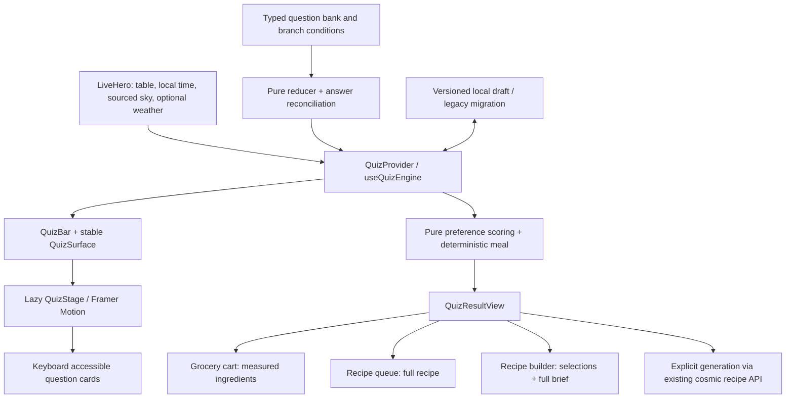

# Adaptive meal quiz

The homepage's `LiveHero` now mounts a configurable culinary quiz. Quick Craft retains the four familiar palate questions. Deep Dive adds dietary boundaries, preparation constraints, context and four independent ESMS preference dimensions, with 8, 12, 16 or 20 questions. No dependency was added.

## Architecture



All implementation files are in `src/components/home/quiz`. `types.ts` defines the public types; `quizQuestions.ts` is the ordered configuration; `quizMachine.ts` owns progress, `quizPersistence.ts` validates and migrates drafts; `quizScoring.ts` composes a measured meal; `quizIntegrations.ts` translates it for existing site services, and `quizGeneratedRecipes.ts` validates generated recipe responses. The question registry composes separate core and context banks. The existing `firstMeal.ts` exports remain compatible.

## Configuration contract

The source of truth is `QuizQuestion` in `types.ts`:

```ts
interface QuizQuestion {
  id: string;
  prompt: string | ((context: QuizContext, answers: QuizAnswers) => string);
  subprompt?: string;
  category: "palate" | "context" | "preparation" | "dietary" | "esms";
  tier: 1 | 2 | 3 | 4 | 5;
  selection: "single" | "multiple";
  options: readonly QuizOption[];
  condition?: QuizCondition;
  isQuickQuestion?: boolean;
}
```

Stable question and option IDs are stored, never array indices. Each option carries labels, explanatory copy, separate elemental and ESMS weights, optional eligibility conditions, and an optional `exclusive` flag. Conditions receive typed context and the current answer record. Prompts can use the same inputs. `getActiveQuestions` applies question conditions before selecting the requested depth; `getQuestionOptions` filters each question's options.

To extend the bank, add an entry with a unique ID, declare any dependencies using conditions, and add its interpretation to the scoring or downstream adapter if it changes recipe behavior. Keep dependencies earlier than their dependents. Conditional questions must retain at least one available option on every active path. The current bank branches protein choices based on diet and exclusions; backward edits remove incompatible saved protein answers.

| Track              | Questions                                              |
| ------------------ | ------------------------------------------------------ |
| Quick / first four | Hunger, heat, flavor, pace                             |
| Deep 8             | Above + diet, allergens, protein, meal moment          |
| Deep 12            | Above + texture, time, equipment, sky preference       |
| Deep 16            | Above + season, weather preference, servings, spice    |
| Deep 20            | Above + Spirit, Essence, Matter, Substance preferences |

Diet and allergens precede protein so even the shortest Deep Dive can enforce those boundaries. Switching to Quick preserves known dietary restrictions and the longer draft. Preference points are calculated only from the active track; the complete valid answer record remains available for handoffs.

## State and persistence

React Context wraps a pure reducer; consumers use `useQuiz()` with no progress props threaded through the UI. States are `idle`, `questions` and `result`, with visibility tracked separately. Actions cover hydration, start, close, select, next, back, restart, mode, depth and context reconciliation.

- Next is guarded until the current question has a valid selection.
- Back follows the currently active path, so branching never relies on stale history.
- Mode/depth changes retain valid answers and route to an unanswered question when needed.
- Reconciliation sanitizes all answers, including inactive saved answers, after context or upstream changes.
- Result status is derived from completion, never trusted from persisted data.
- `alchm:quiz:v2` saves a versioned local draft. Both previous four-answer storage keys migrate. Corrupt or inaccessible storage falls back to an in-memory session.

## Context and data provenance

`LiveHero` accepts `quizContext?: Partial<QuizContext>` for sourced weather, lunar phase, season or other caller overrides. Its default context uses local time, the existing table composite, authentication, planetary hour and available sign positions. The default season convention is Northern Hemisphere; a location-aware caller can override it. Weather is optional and no location permission is requested.

The existing `/api/alchm-quantities` response is schema-validated; degraded data is not presented as a measured quiz input. Three distinct concepts remain separate:

1. Elemental preference percentages describe the diner's answers, with a small table influence. They sum to 100.
2. ESMS preference points come directly from the final four questions. They are neither token balances nor physical measurements.
3. Optional `planetaryESMS` carries sourced sky quantities unchanged into the generation brief. It never becomes preference points.

The offline recipe's elemental vector comes from resolved ingredient catalog signatures, with explicit provenance. AI elemental values retain their generated provenance; no thermodynamic accuracy claim is made by this UI.

## Site integrations

| Action    | Behavior                                                                                                              |
| --------- | --------------------------------------------------------------------------------------------------------------------- |
| Reveal    | Immediate, deterministic measured recipe with servings, preparation assumptions and instructions; no API required     |
| Shop      | Adds actual quantities through `GroceryCartContext`, preserving base servings; repeated clicks open the existing cart |
| Save      | Adds the complete recipe through `RecipeQueueContext`, using recipe identity to avoid duplicate entries               |
| Refine    | Atomically seeds `RecipeBuilderContext`, then opens `/recipe-builder`                                                 |
| Explore   | Opens the recipe collection using the suggested cuisine                                                               |
| AI recipe | Explicit POST to `/api/generate-cosmic-recipe`, using the existing demo/auth/payment behavior                         |

The builder consumes ingredients, cuisine, cooking method, diet, allergen exclusions and maximum preparation time through its existing recommendation endpoint. The full quiz brief is retained and visible in the builder. Equipment, servings, texture and ESMS preference dimensions are recorded in that brief; the catalog matcher does not currently interpret all of them. The quiz's AI action receives all dimensions directly.

The offline meal composer currently offers Mediterranean-inspired bowls, skillets, soups and tray bakes with protein, flavor, seasonal vegetable and preparation variations. It uses explicitly ready-cooked staples and adjusts the method to available equipment and time. The AI path provides broader variation.

AI request handling includes a request lock, abort on unmount or changed brief, a 90-second timeout, an idempotency key retained across uncertain transport failures, and a validated session cache. Equivalent context rerenders do not cancel a pending request. Response validation rejects unusable measurements, empty content, obvious dietary conflicts, inconsistent serving counts, excess time and recognized unavailable equipment. Keyword checks are conservative and cannot certify allergen safety. Errors leave the original meal available. Cancelling the client request does not promise cancellation or refund of server work.

## Interaction and accessibility

The original hero preview reserves the surface height while hidden and inert during the quiz. The stage overlays that space; questions and long results scroll internally. Header, progress and footer remain available. Quick/Deep controls reserve a consistent row height.

Framer Motion handles directional slide/fade transitions and progress. Reduced-motion users get immediate changes. Question headings receive focus on entry; closing restores the trigger. The stage is a nonmodal dialog and does not trap keyboard focus.

- Number keys select visible options (1–9 where present).
- Enter continues after selection.
- Left/Backspace return to the previous question; Escape closes.
- Single-choice cards implement radio arrow/Home/End navigation and a roving tab stop.
- Multiple-choice cards expose checkbox semantics, including exclusive “none” selections.
- Input fields, modified shortcuts and repeated keys are ignored by quiz-level shortcuts.

## Verification

Run `bun run test --runInBand src/components/home/quiz/__tests__` for the reducer, persistence, constraint, handoff and keyboard tests. Run `bun run typecheck`, `bun run verify:static`, and the full Jest suite for repository checks. Browser verification should cover opening/closing, Quick completion, changing Deep depth, dietary branching, keyboard focus, a narrow viewport and the unchanged outer surface bounds across transitions.
