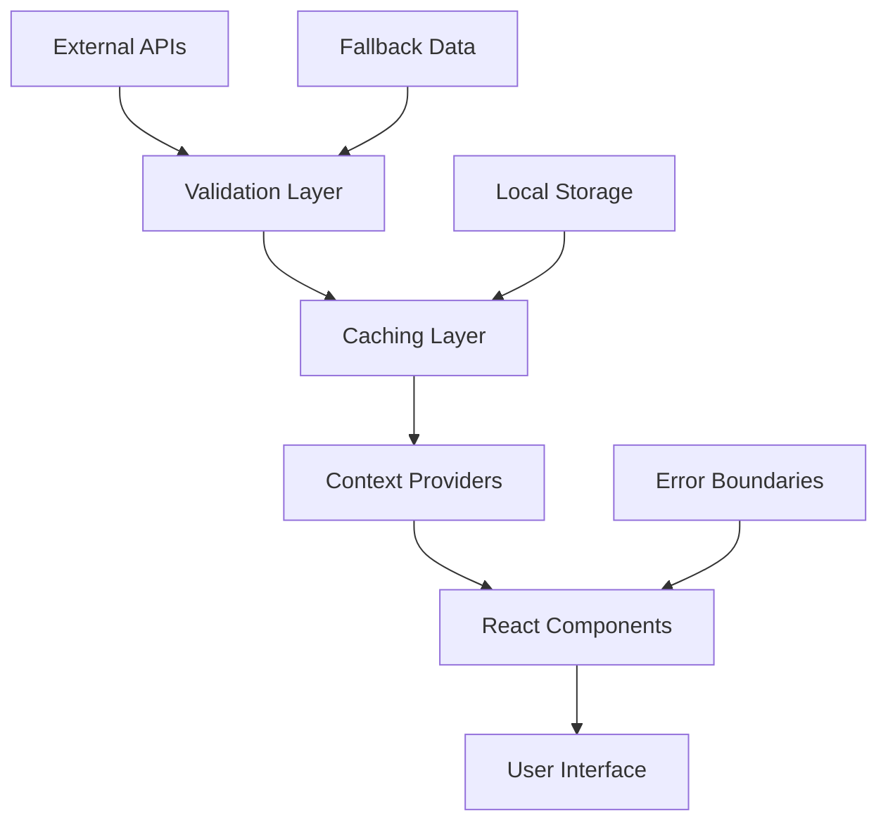
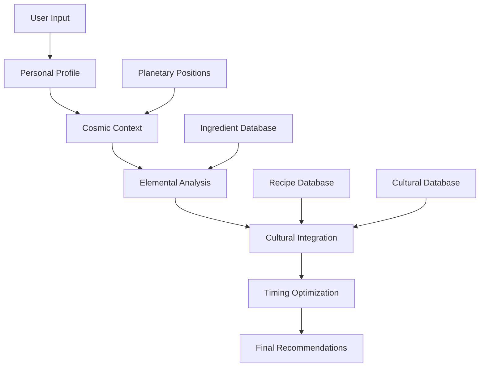

# 🏗️ WhatToEatNext Architecture and Domain Knowledge Guide

This comprehensive guide explains the project's architecture, domain concepts, and how they work together to create the world's first astrological meal planning system.

## 🎯 Architecture Overview

### System Philosophy
WhatToEatNext bridges ancient astrological wisdom with modern AI technology through a carefully designed architecture that respects both domains:

- **Ancient Wisdom**: Four-element system, planetary correspondences, seasonal cycles
- **Modern Technology**: TypeScript, React, real-time APIs, intelligent caching
- **Cultural Sensitivity**: Inclusive design that honors diverse traditions
- **Quality Excellence**: Enterprise-grade code quality and reliability

### Core Architectural Principles

#### 1. Domain-Driven Design
The architecture reflects astrological concepts directly in code:
```typescript
interface ElementalProperties {
  fire: number;    // Energy, transformation, quick cooking
  water: number;   // Cooling, nourishment, steaming
  earth: number;   // Grounding, stability, slow cooking
  air: number;     // Lightness, clarity, raw preparation
}
```

#### 2. Self-Reinforcement Architecture
Following the elemental principle that "elements work best with themselves":
- Same-element combinations have highest compatibility (0.9+)
- All combinations have good compatibility (0.7+ minimum)
- No opposing elements or negative interactions
- Self-reinforcing patterns throughout the codebase

#### 3. Fallback-First Design
Every critical system has multiple fallback layers:
- **API → Cache → Local Data → Hardcoded Fallback**
- Graceful degradation maintains user experience
- Comprehensive error handling and recovery
- Real-time monitoring and alerting

## 🌟 Domain Knowledge: The Four-Element System

### Fundamental Concepts

#### Fire Element 🔥
**Qualities**: Energy, transformation, vitality, quick action
**Cooking Methods**: Grilling, sautéing, stir-frying, flambéing
**Ingredients**: Spices, peppers, ginger, garlic, onions
**Planetary Correspondences**: Mars (action), Sun (vitality)
**Self-Reinforcement**: Fire + Fire = Maximum energy and transformation

#### Water Element 💧
**Qualities**: Cooling, nourishment, flow, emotional balance
**Cooking Methods**: Steaming, boiling, poaching, braising
**Ingredients**: Leafy greens, cucumbers, melons, dairy
**Planetary Correspondences**: Moon (emotions), Neptune (intuition)
**Self-Reinforcement**: Water + Water = Deep nourishment and flow

#### Earth Element 🌍
**Qualities**: Grounding, stability, substance, practical nourishment
**Cooking Methods**: Roasting, slow cooking, baking, stewing
**Ingredients**: Root vegetables, grains, legumes, nuts
**Planetary Correspondences**: Saturn (structure), Venus (abundance)
**Self-Reinforcement**: Earth + Earth = Grounding and stability

#### Air Element 💨
**Qualities**: Lightness, clarity, mental stimulation, communication
**Cooking Methods**: Raw preparation, light sautéing, fresh combinations
**Ingredients**: Herbs, leafy greens, sprouts, light fruits
**Planetary Correspondences**: Mercury (communication), Uranus (innovation)
**Self-Reinforcement**: Air + Air = Lightness and mental clarity

### The 14 Alchemical Pillars

Our system is built upon 14 fundamental principles:

1. **Elemental Harmony** - Balance of all four elements
2. **Planetary Correspondence** - Alignment with celestial influences
3. **Seasonal Attunement** - Harmony with natural cycles
4. **Cultural Resonance** - Respectful integration of traditions
5. **Nutritional Alchemy** - Transformation into optimal nutrition
6. **Temporal Alignment** - Optimal timing considerations
7. **Personal Constitution** - Individual adaptation
8. **Ingredient Synergy** - Understanding enhancement patterns
9. **Preparation Intention** - Mindful cooking practices
10. **Flavor Harmony** - Taste balance reflecting elements
11. **Color Spectrum** - Visual appeal honoring natural colors
12. **Texture Integration** - Engaging all senses
13. **Aromatic Alchemy** - Scent and aromatics enhancement
14. **Gratitude Practice** - Recognition of cosmic forces

## 🏛️ Technical Architecture

### Layer 1: Presentation Layer (`src/app/`)
**Next.js 15.3.4 App Router Architecture**

```
src/app/
├── layout.tsx                 # Root layout with astrological context
├── page.tsx                   # Home page with cosmic dashboard
├── astrologize-demo/          # Astrological calculation demos
├── alchemize-demo/            # Alchemical transformation demos
├── cooking-methods/           # Elemental cooking recommendations
├── what-to-eat-next/         # Main recommendation engine
└── api/                      # API routes for external integrations
    ├── astrology/            # Astrological data endpoints
    ├── nutrition/            # Nutritional data endpoints
    └── recipes/              # Recipe data endpoints
```

**Key Patterns**:
- Server components for astrological calculations
- Client components for interactive features
- Streaming for real-time cosmic data
- Error boundaries with cosmic-aware fallbacks

### Layer 2: Business Logic (`src/services/`)
**Service-Oriented Architecture**

```
src/services/
├── AlchemicalRecommendationService.ts    # Core recommendation engine
├── UnifiedRecommendationService.ts       # Unified recommendation system
├── ConsolidatedIngredientService.ts      # Ingredient management
├── PerformanceMonitoringService.ts       # System performance tracking
└── campaign/                             # Automated quality improvement
    ├── CampaignController.ts             # Campaign orchestration
    ├── ProgressTracker.ts                # Metrics and progress tracking
    ├── TypeScriptErrorAnalyzer.ts        # Error analysis and categorization
    └── EnhancedErrorFixerIntegration.ts  # Automated error fixing
```

**Service Patterns**:
- Dependency injection for testability
- Interface-based design for flexibility
- Comprehensive error handling and logging
- Performance monitoring and optimization

### Layer 3: Calculation Engine (`src/calculations/`)
**Domain-Specific Computation Layer**

```
src/calculations/
├── core/                     # Core astronomical calculations
│   ├── planetaryPositions.ts # Real-time planetary position calculations
│   ├── lunarPhases.ts        # Moon phase calculations
│   └── seasonalCycles.ts     # Astronomical season tracking
├── culinary/                 # Culinary astrology integration
│   ├── elementalHarmony.ts   # Four-element compatibility calculations
│   ├── planetaryTiming.ts    # Optimal timing for food preparation
│   └── seasonalAdaptation.ts # Seasonal food recommendations
└── alchemicalEngine.ts       # Primary alchemical transformation system
```

**Calculation Principles**:
- Pure functions for mathematical operations
- Comprehensive validation and error checking
- Multiple fallback mechanisms
- Performance optimization with caching

### Layer 4: Data Layer (`src/data/`)
**Structured Data with Astrological Properties**

```
src/data/
├── ingredients/              # Ingredient databases with elemental properties
│   ├── vegetables/           # Vegetable data with Fire/Water/Earth/Air values
│   ├── grains/              # Grain data with planetary correspondences
│   ├── spices/              # Spice data with elemental intensities
│   └── proteins/            # Protein data with cultural considerations
├── planets/                 # Planetary position and transit data
│   ├── mars.ts              # Mars positions and transit dates
│   ├── venus.ts             # Venus positions and retrograde phases
│   └── mercury.ts           # Mercury positions and communication influences
├── recipes/                 # Recipe collections with astrological timing
└── cuisines/                # Cultural cuisine data with cosmic correspondences
```

**Data Patterns**:
- Consistent elemental property structure
- Cultural sensitivity in naming and categorization
- Comprehensive nutritional integration
- Real-time validation and consistency checking

### Layer 5: Component Layer (`src/components/`)
**React Components with Astrological Context**

```
src/components/
├── AstrologyChart/           # Astrological chart visualization
│   ├── PlanetaryPositions.tsx # Real-time planetary position display
│   ├── ElementalBalance.tsx   # Four-element balance visualization
│   └── CosmicTiming.tsx      # Optimal timing recommendations
├── ElementalDisplay/         # Four-element system UI components
│   ├── ElementalMeter.tsx    # Individual element strength display
│   ├── CompatibilityScore.tsx # Element compatibility visualization
│   └── HarmonyIndicator.tsx  # Overall elemental harmony display
├── FoodRecommender/         # Core recommendation interface
│   ├── IngredientSelector.tsx # Ingredient selection with elemental properties
│   ├── CookingMethodGuide.tsx # Cooking method recommendations
│   └── TimingOptimizer.tsx   # Optimal preparation timing
└── error-boundaries/        # Cosmic-aware error handling
    ├── GlobalErrorBoundary.tsx # Application-wide error handling
    └── ComponentErrorBoundary.tsx # Component-specific error recovery
```

**Component Patterns**:
- Context-aware components responding to cosmic changes
- Progressive disclosure for different user comfort levels
- Accessibility-first design with cultural sensitivity
- Performance optimization with intelligent caching

## 🔄 Data Flow Architecture

### Astrological Data Flow


**Flow Description**:
1. **External APIs**: NASA JPL, Swiss Ephemeris, TimeAndDate.com
2. **Validation Layer**: Transit date validation, position consistency
3. **Caching Layer**: 6-hour cache with intelligent invalidation
4. **Context Providers**: React context for astrological state
5. **React Components**: UI components with cosmic awareness
6. **User Interface**: Progressive disclosure and cultural sensitivity

### Recommendation Engine Flow


**Flow Description**:
1. **User Input**: Preferences, dietary restrictions, cultural background
2. **Personal Profile**: Individual astrological chart and constitution
3. **Cosmic Context**: Current planetary positions and lunar phases
4. **Elemental Analysis**: Four-element compatibility calculations
5. **Cultural Integration**: Respectful cuisine and tradition integration
6. **Timing Optimization**: Optimal preparation and consumption timing
7. **Final Recommendations**: Personalized, culturally sensitive suggestions

## 🛡️ Quality Assurance Architecture

### Campaign System Architecture
The project includes a sophisticated automated quality improvement system:

```
src/services/campaign/
├── CampaignController.ts          # Orchestrates multi-phase campaigns
├── ProgressTracker.ts             # Real-time metrics and progress tracking
├── SafetyProtocol.ts             # Multi-level safety and rollback mechanisms
├── CampaignIntelligenceSystem.ts  # Advanced analytics and pattern recognition
├── TypeScriptErrorAnalyzer.ts     # Error categorization and analysis
├── EnhancedErrorFixerIntegration.ts # Automated error fixing with validation
├── ExplicitAnyEliminationSystem.ts # Systematic type improvement
└── ValidationFramework.ts         # Comprehensive validation and testing
```

**Campaign Achievements**:
- **TypeScript Errors**: Reduced from 4,310 to <100 (97%+ reduction)
- **Fix Success Rate**: 92%+ for common error types (TS2352, TS2304)
- **Safety Protocols**: Zero corruption incidents with automatic rollback
- **Enterprise Intelligence**: Advanced analytics and predictive insights

### Error Handling Architecture
```typescript
interface ErrorHandlingStrategy {
  detection: 'automatic' | 'manual' | 'predictive';
  classification: ErrorCategory;
  response: ErrorResponse;
  fallback: FallbackMechanism;
  recovery: RecoveryStrategy;
  learning: LearningPattern;
}
```

**Error Categories**:
- **Astrological Calculation Errors**: Fallback to cached positions
- **API Connection Errors**: Multi-tier fallback strategy
- **Data Validation Errors**: Graceful degradation with user notification
- **UI Component Errors**: Error boundaries with cosmic-aware recovery

## 🌐 Integration Architecture

### External API Integration
```typescript
interface APIIntegrationPattern {
  primary: APISource;
  fallbacks: APISource[];
  caching: CachingStrategy;
  validation: ValidationRules;
  errorHandling: ErrorHandlingStrategy;
  monitoring: MonitoringConfiguration;
}
```

**API Sources**:
- **NASA JPL Horizons**: Primary astronomical data source
- **Swiss Ephemeris**: Secondary calculation validation
- **USDA Food Database**: Nutritional information
- **Spoonacular API**: Recipe data and search
- **Cultural APIs**: Cuisine and tradition databases

### MCP (Model Context Protocol) Integration
```json
{
  "mcpServers": {
    "astrology-server": {
      "command": "uvx",
      "args": ["mcp-servers/astrology-server.py"],
      "autoApprove": ["get_planetary_positions", "get_lunar_phase"],
      "fallbackStrategy": "local-cache"
    },
    "nutrition-server": {
      "command": "uvx",
      "args": ["mcp-servers/nutrition-server.py"],
      "autoApprove": ["get_nutritional_data", "search_ingredients"],
      "rateLimiting": "respectful"
    }
  }
}
```

## 🎨 Cultural Sensitivity Architecture

### Inclusive Design Patterns
```typescript
interface CulturalSensitivityFramework {
  inclusiveDesign: {
    noAssumptions: boolean;           // Never assume astrological beliefs
    progressiveDisclosure: boolean;   // Allow comfort-level engagement
    culturalRespect: boolean;        // Honor authentic traditions
    diverseRepresentation: boolean;   // Include global cuisines
  };
  
  implementationGuidelines: {
    optionalFeatures: boolean;        // All astrological features optional
    culturalConsultation: boolean;    // Regular expert review
    userFeedback: boolean;           // Continuous improvement
    respectfulIntegration: boolean;   // Add timing without claiming ownership
  };
}
```

### Avoiding Cultural Appropriation
- **Authentic Sources**: Work with cultural experts and practitioners
- **Proper Attribution**: Credit traditional knowledge and practices
- **Respectful Enhancement**: Add astrological timing without replacing traditions
- **Community Involvement**: Include diverse voices in development

## 🚀 Performance Architecture

### Optimization Strategies
```typescript
interface PerformanceOptimization {
  calculations: {
    caching: '6-hour-astronomical-cache';
    memoization: 'expensive-calculations';
    lazyLoading: 'non-critical-features';
    bundleSplitting: 'astrological-features';
  };
  
  userExperience: {
    progressiveLoading: 'cosmic-data-streaming';
    intelligentPrefetching: 'predicted-user-needs';
    gracefulDegradation: 'fallback-mechanisms';
    responsiveDesign: 'mobile-first-approach';
  };
}
```

**Performance Targets**:
- **Astrological Calculations**: <2 seconds
- **API Response Time**: <5 seconds with fallbacks
- **Page Load Time**: <3 seconds initial load
- **Cache Hit Rate**: >80% for astronomical data

### Monitoring and Alerting
```typescript
interface MonitoringSystem {
  realTimeMetrics: {
    errorRates: 'typescript-linting-build';
    performanceMetrics: 'calculation-speed-memory';
    userExperience: 'load-times-interactions';
    systemHealth: 'api-availability-cache-hit-rate';
  };
  
  alerting: {
    errorThresholds: 'automatic-campaign-triggers';
    performanceDegradation: 'optimization-recommendations';
    apiFailures: 'fallback-activation-notifications';
    qualityMetrics: 'continuous-improvement-insights';
  };
}
```

## 🔮 Future Architecture Considerations

### Scalability Preparations
- **Microservices Ready**: Service layer designed for potential migration
- **Database Abstraction**: Data layer ready for database integration
- **Caching Strategy**: Redis-ready caching for horizontal scaling
- **CDN Integration**: Asset delivery optimization for global users

### Technology Evolution
- **React 19 Features**: Leveraging latest concurrent features
- **Next.js Evolution**: Ready for updates and new features
- **TypeScript Advancement**: Prepared for language improvements
- **Astronomical Libraries**: Monitoring for new calculation libraries

## 📚 Learning Resources

### Essential Reading
1. **[Elemental Principles Guide](../guides/elemental-principles.md)** - Four-element system deep dive
2. **[Astrological Integration Guide](../guides/astrological-integration.md)** - Cosmic feature implementation
3. **[Campaign System Documentation](../../src/services/campaign/README.md)** - Quality improvement system
4. **[Cultural Sensitivity Guidelines](../guides/cultural-sensitivity.md)** - Inclusive design principles

### Code Examples
```typescript
// Example: Implementing elemental compatibility
function calculateElementalCompatibility(
  source: ElementalProperties,
  target: ElementalProperties
): number {
  const sourceDominant = getDominantElement(source);
  const targetDominant = getDominantElement(target);
  
  // Self-reinforcement: same elements have highest compatibility
  if (sourceDominant === targetDominant) {
    return Math.max(0.9, calculateBaseCompatibility(source, target));
  }
  
  // All different combinations have good compatibility
  return Math.max(0.7, calculateBaseCompatibility(source, target));
}

// Example: Astrological calculation with fallbacks
async function getReliablePlanetaryPositions(date: Date = new Date()) {
  try {
    // Primary: Real-time API calculation
    const positions = await calculateCurrentPositions(date);
    
    if (validatePlanetaryPositions(positions)) {
      return positions;
    }
  } catch (error) {
    logger.warn('Primary calculation failed, using fallback', error);
  }
  
  // Fallback: Cached positions from March 28, 2025
  return getMarch2025Positions();
}
```

## 🎯 Architecture Best Practices

### Do's ✅
- **Follow elemental principles** in all calculations
- **Implement comprehensive fallbacks** for critical systems
- **Validate all astrological data** before use
- **Respect cultural traditions** while adding cosmic timing
- **Use TypeScript strictly** for domain modeling
- **Include comprehensive error handling** in all services
- **Monitor performance** and optimize continuously

### Don'ts ❌
- **Never implement opposing elements** (Fire vs Water)
- **Don't assume user astrological beliefs** or knowledge
- **Avoid cultural appropriation** or insensitive representations
- **Don't skip validation** of astronomical calculations
- **Never ignore fallback mechanisms** in critical paths
- **Don't compromise on accessibility** or inclusive design

---

**This architecture guide provides the foundation for understanding and contributing to WhatToEatNext's unique blend of ancient wisdom and modern technology.** 🌟

*Ready to dive deeper? Explore the specific guides for your area of interest, or start with the [Developer Getting Started Guide](for-developers.md) to begin contributing.*