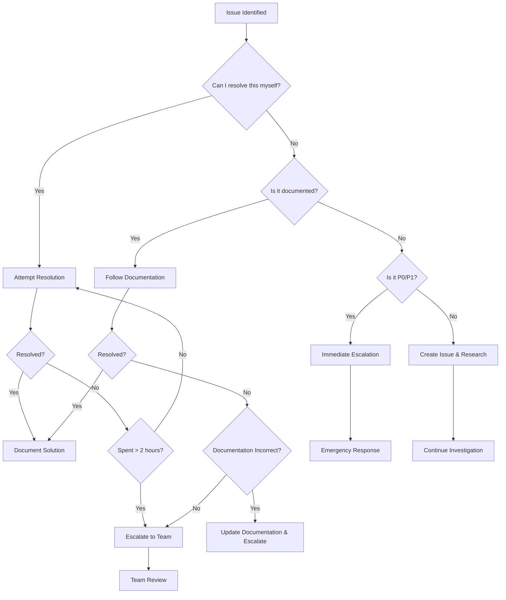

# 📞 Escalation Procedures

This guide defines when and how to escalate issues within the WhatToEatNext
project, ensuring appropriate response times and expertise for different types
of problems.

## 🎯 Escalation Matrix

### Issue Severity Classification

#### 🔴 P0 - Critical (Immediate Escalation)

**Response Time**: 15 minutes  
**Resolution Time**: 2 hours

**Criteria:**

- Complete system failure or unavailability
- Data corruption or loss
- Security vulnerabilities or breaches
- Complete astrological calculation system failure
- Production deployment blocking issues

**Examples:**

```
❌ Build completely broken, cannot deploy
❌ All astrological APIs failing with no fallback
❌ Data corruption in planetary position files
❌ Security vulnerability in API endpoints
❌ Campaign system causing data loss
```

#### 🟡 P1 - High (Same Day Escalation)

**Response Time**: 2 hours  
**Resolution Time**: 24 hours

**Criteria:**

- Major feature completely non-functional
- Performance severely degraded (>10x slower)
- Incorrect astrological calculations affecting recommendations
- Campaign system failures causing build issues
- Critical TypeScript errors preventing development

**Examples:**

```
⚠️ Planetary position calculations returning wrong signs
⚠️ Elemental compatibility scores below 0.7
⚠️ Performance degraded from 2s to 20s+ for calculations
⚠️ Campaign system stuck in infinite loop
⚠️ TypeScript errors > 5000 blocking development
```

#### 🟢 P2 - Medium (Next Business Day)

**Response Time**: 24 hours  
**Resolution Time**: 1 week

**Criteria:**

- Minor feature issues or inconsistencies
- Performance slightly degraded but usable
- UI/UX problems affecting user experience
- Documentation gaps or inaccuracies
- Non-critical linting or code quality issues

**Examples:**

```
⚠️ Some ingredient recommendations not optimal
⚠️ UI components not responsive on mobile
⚠️ Documentation outdated or missing
⚠️ Linting warnings > 10,000
⚠️ Bundle size larger than target
```

#### 🔵 P3 - Low (Best Effort)

**Response Time**: 1 week  
**Resolution Time**: Next release cycle

**Criteria:**

- Enhancement requests
- Minor UI inconsistencies
- Non-critical warnings or logs
- Optimization opportunities
- Nice-to-have features

**Examples:**

```
💡 Request for new astrological feature
💡 Minor styling improvements
💡 Performance optimization opportunities
💡 Additional documentation requests
💡 Code refactoring suggestions
```

## 🚨 Emergency Response Procedures

### P0 Critical Issue Response

#### Immediate Actions (0-15 minutes)

```bash
# 1. Assess and contain the issue
npm run emergency:assess          # Quick system assessment
npm run emergency:contain         # Contain the issue if possible

# 2. Notify stakeholders immediately
# - Send alert to #critical-alerts Slack channel
# - Email dev-team@company.com with "P0 CRITICAL" subject
# - Page on-call engineer if after hours

# 3. Create incident record
# - GitHub issue with "P0-Critical" label
# - Include system state, error logs, and impact assessment
# - Document timeline and actions taken
```

#### Response Team Assembly (15-30 minutes)

```
Primary Responder: On-call engineer or issue reporter
Technical Lead: Senior developer familiar with affected system
Subject Matter Expert: Astrological calculations expert (if relevant)
Incident Commander: Project maintainer or designated lead
Communications Lead: For stakeholder updates
```

#### Resolution Process (30 minutes - 2 hours)

```bash
# 1. Implement immediate workaround if possible
npm run emergency:workaround      # Apply temporary fix

# 2. Investigate root cause
npm run debug:comprehensive       # Full system diagnostic
npm run logs:critical            # Gather all relevant logs

# 3. Implement permanent fix
# - Create hotfix branch
# - Implement and test fix
# - Deploy with expedited process

# 4. Post-incident review
# - Document lessons learned
# - Update procedures if needed
# - Implement preventive measures
```

### P1 High Priority Response

#### Initial Response (0-2 hours)

```bash
# 1. Acknowledge and assess
npm run health:check             # System health assessment
npm run debug:targeted           # Focused debugging

# 2. Notify relevant team members
# - Post in #dev-alerts Slack channel
# - Assign GitHub issue to appropriate team member
# - Update project status if needed

# 3. Begin investigation
npm run investigate:issue        # Start detailed investigation
npm run logs:recent             # Gather recent logs and metrics
```

#### Resolution Process (2-24 hours)

```
1. Root Cause Analysis
   - Identify the underlying cause
   - Determine scope of impact
   - Assess risk of similar issues

2. Solution Development
   - Design appropriate fix
   - Consider impact on other systems
   - Plan testing strategy

3. Implementation and Testing
   - Implement fix in development environment
   - Run comprehensive tests
   - Validate fix resolves issue

4. Deployment and Monitoring
   - Deploy to staging for validation
   - Deploy to production with monitoring
   - Monitor for regression or side effects
```

## 🔍 Escalation Decision Tree

### When to Escalate



### Escalation Triggers

#### Automatic Escalation Triggers

```typescript
// Automated monitoring that triggers escalation
interface EscalationTrigger {
  condition: string;
  severity: 'P0' | 'P1' | 'P2' | 'P3';
  action: string;
  notification: string[];
}

const ESCALATION_TRIGGERS: EscalationTrigger[] = [
  {
    condition: 'build_failure_duration > 30_minutes',
    severity: 'P0',
    action: 'immediate_escalation',
    notification: ['#critical-alerts', 'dev-team@company.com']
  },
  {
    condition: 'astrological_calculation_errors > 50%',
    severity: 'P1',
    action: 'team_escalation',
    notification: ['#dev-alerts', 'astrology-team@company.com']
  },
  {
    condition: 'typescript_errors > 5000',
    severity: 'P1',
    action: 'campaign_escalation',
    notification: ['#dev-alerts']
  },
  {
    condition: 'performance_degradation > 5x',
    severity: 'P1',
    action: 'performance_escalation',
    notification: ['#performance-alerts']
  }
];
```

#### Manual Escalation Criteria

```
Escalate immediately if:
✅ You've spent 2+ hours without progress
✅ Issue affects multiple team members
✅ Issue blocks critical development work
✅ You lack expertise in the affected area
✅ Issue has security implications
✅ Data integrity is at risk

Consider escalation if:
⚠️ Solution requires architectural changes
⚠️ Issue affects external dependencies
⚠️ Multiple systems are involved
⚠️ Cultural sensitivity concerns arise
⚠️ Performance impact is significant
```

## 👥 Escalation Contacts and Expertise

### Technical Expertise Areas

#### Astrological Calculations Team

**Contact**: astrology-team@company.com  
**Slack**: #astrology-dev  
**Expertise**:

- Planetary position calculations
- Transit date validation
- Elemental compatibility algorithms
- Astronomical API integrations
- Fallback mechanism design

**Escalate for**:

- Incorrect planetary positions
- Transit date validation failures
- Elemental compatibility scores < 0.7
- API integration issues
- Astronomical calculation performance

#### Campaign System Team

**Contact**: campaign-team@company.com  
**Slack**: #campaign-system  
**Expertise**:

- Automated code quality improvement
- TypeScript error reduction campaigns
- Build system optimization
- Safety protocol implementation
- Progress tracking and metrics

**Escalate for**:

- Campaign system failures
- TypeScript error count explosions
- Build performance issues
- Safety protocol violations
- Metrics collection problems

#### Performance and Infrastructure Team

**Contact**: performance-team@company.com  
**Slack**: #performance  
**Expertise**:

- System performance optimization
- Memory leak detection and resolution
- Bundle size optimization
- API performance tuning
- Monitoring and alerting

**Escalate for**:

- Performance degradation > 2x
- Memory leaks or excessive usage
- Bundle size > 10MB
- API response times > 10 seconds
- System resource exhaustion

#### Cultural Sensitivity Team

**Contact**: cultural-team@company.com  
**Slack**: #cultural-sensitivity  
**Expertise**:

- Cultural appropriation prevention
- Inclusive design practices
- Respectful representation
- Community engagement
- Ethical AI implementation

**Escalate for**:

- Cultural appropriation concerns
- Representation issues
- Community feedback about sensitivity
- Ethical concerns about AI recommendations
- Accessibility compliance issues

### External Escalation Contacts

#### Security Issues

**Contact**: security@company.com  
**Process**:

1. Do NOT post in public channels
2. Send encrypted email to security team
3. Include detailed vulnerability report
4. Wait for security team response before any action

#### Legal/Compliance Issues

**Contact**: legal@company.com  
**Process**:

1. Immediate notification for any legal concerns
2. Document all relevant information
3. Preserve evidence if applicable
4. Follow legal team guidance exactly

#### Vendor/API Issues

**Primary APIs**:

- **Astronomy APIs**: Contact API provider support
- **Nutritional APIs**: USDA/Spoonacular support channels
- **Infrastructure**: Cloud provider support

**Process**:

1. Check API status pages first
2. Review API documentation for known issues
3. Contact vendor support with detailed information
4. Escalate internally if vendor response is inadequate

## 📋 Escalation Documentation Requirements

### Issue Report Template

#### P0 Critical Issue Report

```markdown
# P0 CRITICAL ISSUE

## Summary
Brief description of the critical issue

## Impact
- Systems affected: [list]
- Users affected: [number/percentage]
- Business impact: [description]
- Data at risk: [yes/no, details]

## Timeline
- Issue first detected: [timestamp]
- Issue reported: [timestamp]
- Response team assembled: [timestamp]
- Workaround implemented: [timestamp]
- Resolution: [timestamp]

## Technical Details
- Error messages: [paste relevant errors]
- System state: [describe current state]
- Recent changes: [deployments, config changes, etc.]
- Logs: [attach or link to relevant logs]

## Immediate Actions Taken
1. [Action 1]
2. [Action 2]
3. [Action 3]

## Next Steps
1. [Next step 1]
2. [Next step 2]
3. [Next step 3]

## Team Members Involved
- Primary responder: [@username]
- Technical lead: [@username]
- Subject matter expert: [@username]
- Incident commander: [@username]
```

#### P1 High Priority Issue Report

```markdown
# P1 HIGH PRIORITY ISSUE

## Summary
Description of the high priority issue

## Impact Assessment
- Feature affected: [specific feature]
- User experience impact: [description]
- Development impact: [description]
- Performance impact: [metrics]

## Investigation Status
- Root cause identified: [yes/no]
- Workaround available: [yes/no, details]
- Fix complexity: [simple/moderate/complex]
- Estimated resolution time: [timeframe]

## Technical Analysis
- System components involved: [list]
- Error patterns: [description]
- Performance metrics: [before/after]
- Dependencies affected: [list]

## Resolution Plan
1. [Step 1]
2. [Step 2]
3. [Step 3]

## Testing Strategy
- Unit tests: [required tests]
- Integration tests: [required tests]
- Performance validation: [metrics to check]
- Regression testing: [areas to test]
```

### Communication Templates

#### Stakeholder Update Template

```markdown
Subject: [P0/P1] Issue Update - [Brief Description]

## Current Status
[Current state of the issue]

## Impact
[What is affected and how]

## Actions Taken
[What has been done so far]

## Next Steps
[What will be done next]

## Timeline
[Expected resolution timeframe]

## Contact
[Who to contact for questions]
```

#### Post-Incident Report Template

```markdown
# Post-Incident Report

## Incident Summary
- Incident ID: [unique identifier]
- Severity: [P0/P1/P2/P3]
- Duration: [start time - end time]
- Impact: [description of impact]

## Timeline
[Detailed timeline of events]

## Root Cause Analysis
[What caused the issue]

## Resolution
[How the issue was resolved]

## Lessons Learned
[What we learned from this incident]

## Action Items
[Preventive measures to implement]

## Process Improvements
[How to improve our response next time]
```

## 🔄 Escalation Process Improvement

### Regular Review Process

#### Monthly Escalation Review

```
Review Agenda:
1. Escalation volume and trends
2. Response time analysis
3. Resolution effectiveness
4. Process bottlenecks
5. Team feedback
6. Improvement opportunities

Metrics to Track:
- Average response time by severity
- Resolution time by category
- Escalation accuracy (correct severity assignment)
- Team satisfaction with escalation process
- Repeat issues (indicating systemic problems)
```

#### Quarterly Process Updates

```
Update Process:
1. Review escalation procedures
2. Update contact information
3. Refine severity criteria
4. Update automation triggers
5. Train team on changes
6. Document lessons learned
```

### Continuous Improvement

#### Feedback Collection

```typescript
// Escalation feedback form
interface EscalationFeedback {
  incidentId: string;
  severity: 'P0' | 'P1' | 'P2' | 'P3';
  responseTime: number;
  resolutionTime: number;
  processEffectiveness: 1 | 2 | 3 | 4 | 5;
  communicationQuality: 1 | 2 | 3 | 4 | 5;
  suggestions: string;
  wouldEscalateAgain: boolean;
}
```

#### Process Metrics

```typescript
// Track escalation process health
interface EscalationMetrics {
  totalEscalations: number;
  averageResponseTime: number;
  averageResolutionTime: number;
  escalationAccuracy: number;
  repeatIssueRate: number;
  teamSatisfaction: number;
  processImprovements: number;
}
```

## 🎓 Training and Onboarding

### New Team Member Escalation Training

#### Training Checklist

```
□ Review escalation procedures document
□ Understand severity classification
□ Practice using escalation tools
□ Shadow experienced team member during escalation
□ Complete escalation simulation exercise
□ Review recent escalation case studies
□ Understand cultural sensitivity requirements
□ Know when to involve security team
```

#### Escalation Simulation Exercises

```
Scenario 1: P0 Critical - Complete system failure
- Practice immediate response procedures
- Learn stakeholder communication
- Understand incident command structure

Scenario 2: P1 High - Astrological calculation errors
- Practice technical investigation
- Learn when to involve subject matter experts
- Understand resolution validation

Scenario 3: Cultural Sensitivity Issue
- Practice appropriate escalation channels
- Learn respectful communication
- Understand legal/compliance implications
```

### Regular Team Training

#### Monthly Training Topics

```
Month 1: Escalation Basics and Severity Classification
Month 2: Technical Debugging and Investigation
Month 3: Communication and Stakeholder Management
Month 4: Cultural Sensitivity and Ethical Considerations
Month 5: Security Incident Response
Month 6: Post-Incident Analysis and Improvement
```

---

**Remember**: Escalation is not a sign of failure - it's a sign of good
judgment. When in doubt, escalate early rather than late. The goal is to resolve
issues effectively while learning and improving our processes. 🚀
