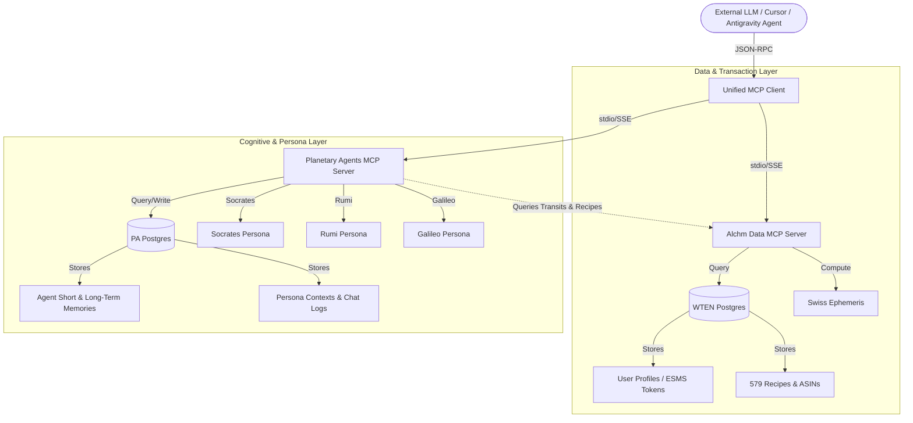

# Alchm.kitchen MCP Server Architecture

This document outlines the dual-database, multi-agent Model Context Protocol (MCP) architecture powering the data calculations, alchemical scoring, and cognitive persona layers of **Alchm.kitchen (Alchm)** and **Planetary Agents (PA)**.

---

## 🗺️ Architectural Topology

Our system implements a strict, enterprise-grade separation of concerns between user-facing transactions and agent-focused cognitive state, anchored by two separate databases and bridged by the Model Context Protocol.



---

## 🗄️ Database Separation

1.  **WTEN Postgres (Transactional Web Anchor)**:
    *   **Scope**: Manages user profiles, birth data, alchemical reserves (ESMS balances), Stripe subscriptions, daily limits, and Amazon Fresh shopping carts.
    *   **Characteristics**: Highly optimized for transactional integrity, fast user hydration, and deterministic operations.
2.  **PA Postgres (Cognitive Agent Anchor)**:
    *   **Scope**: Manages agent long-term memory logs, conversational histories, vector memories, and historical character state files.
    *   **Characteristics**: Isolated to prevent massive agent conversational logs from bloating or degrading performance on transactional user tables.

---

## 🛠️ Exposing the Alchm MCP Server Tools

The `alchm-mcp-server` resides in `mcp-server/` and runs on Bun. It exposes three primary tools over the Stdio transport channel:

### 1. `get_live_sky_transits`
*   **Purpose**: Computes live planetary degrees and active elements.
*   **Arguments**:
    *   `latitude`: (optional) number
    *   `longitude`: (optional) number
*   **Output**: Current sky elements (Fire, Water, Earth, Air), dominant sign placements, and house degrees calculated using Swiss Ephemeris.

### 2. `alchemize_ingredients`
*   **Purpose**: Computes the Spirit, Essence, Matter, and Substance (ESMS) balances of raw foods.
*   **Arguments**:
    *   `ingredients`: (required) array of strings (e.g. `["tomato", "basil"]`)
*   **Output**: Individual ingredient scores, overall alchemical harmony ratings, and thermodynamic indices (heat, entropy, reactivity).

### 3. `generate_cosmic_recipe`
*   **Purpose**: Discovers cosmos-aligned dishes from our high-performance recipe catalog.
*   **Arguments**:
    *   `prompt`: (optional) string search keyword
    *   `cuisine`: (optional) string
    *   `dietary`: (optional) array of restrictions (`['vegetarian', 'vegan']`)
    *   `dominantElement`: (optional) target element (`'Fire' | 'Water' | 'Earth' | 'Air'`)
*   **Output**: High-fidelity recipes with complete ingredient quantities and alchemical properties.

---

## 🔗 Running Locally

You can launch this server inside any LLM environment (Cursor, Claude Desktop, Google Antigravity SDK) using Bun:

```bash
bun run mcp-server/src/index.ts
```

Ensure the `DATABASE_URL` is set in your environment variables to connect directly to the WTEN database, or run without it to automatically fallback to local static assets.

See **[`README.md`](./README.md)** for the full setup, per-call auth (`_meta.apiKey`), connector config templates for Claude Desktop / Cursor, and the operational telemetry exposed on the admin dashboard.

---

## 🧱 Internal Code Layout

The tool handlers, auth wrapper, and invocation logger live in `src/lib/mcp/` (Next.js app side) so the same code is exercised by:

- **The stdio MCP server** (`mcp-server/src/index.ts`) — production surface for external LLM clients.
- **The synthetic MCP probe** (`src/services/syntheticProbeService.ts` → `runMcpProbe()`) — cron-triggered health check that catches breakage at the handler layer even when no organic traffic flows.
- **The unit tests** (`src/lib/mcp/__tests__/tools.test.ts`) — exercise handlers + auth gate without Bun.
- **The integration test** (`mcp-server/src/__tests__/stdio.test.ts`, gated on `MCP_E2E=1`) — verifies the JSON-RPC transport.

```
src/lib/mcp/
├── tools.ts          ← invokeTool() + 3 handlers; single source of truth
├── auth.ts           ← _meta.apiKey resolution + ESMS token debit
└── invocationLog.ts  ← fire-and-forget writes to mcp_invocations

mcp-server/src/
└── index.ts          ← stdio transport + MCP SDK registration; delegates to invokeTool
```

## 📊 Observability

Every tool invocation writes one row to `mcp_invocations` (Postgres). That table feeds three surfaces:

| Surface | What it shows | Source |
| --- | --- | --- |
| `/admin` → System Status → **MCP Tool Surface** flow | Call rate, error rate, p95 latency, synthetic-probe verdict (1h window) | `systemStatusService.probeMcp()` |
| `/admin/dashboard` → Agent Telemetry → **mcpInvocationRate** | Live calls/hour as a 4th metric alongside transmutation/entropy/harmony | `agentTelemetryService.getAgentNetworkTelemetry()` |
| `/api/cron/synthetic-mcp` | 30-min synthetic exercise of `get_live_sky_transits` + `generate_cosmic_recipe` | `syntheticProbeService.runMcpProbe()` |

Retention is 7 days, swept by the existing `observability-prune` daily cron.
